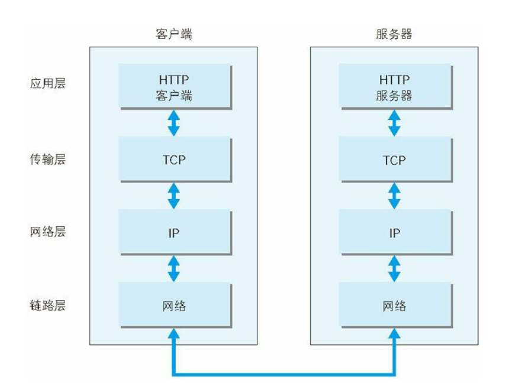
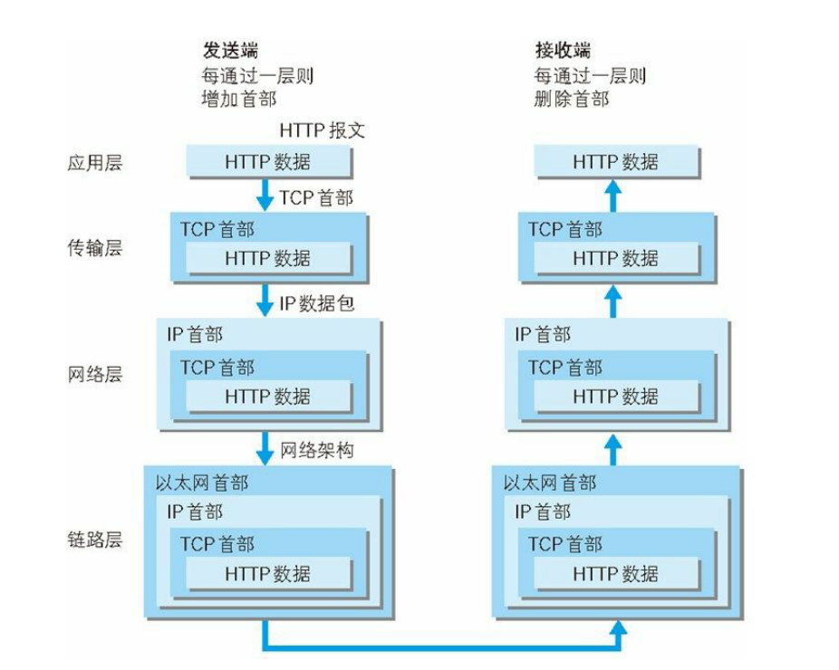

#### TCP/IP 分层
TCP/IP协议按层分为以下四层
1. 应用层
    > 向用户提供应用服务时通讯的活动。
    TCP/IP协议内预存了各类通用的应用服务：
    FTP(文件传输协议)、DNS(域名系统)、HTTP(超文本传输协议)
2. 传输层
    > 传输层对上层应用层，提供处于网络连接中的两台计算机之间的数据传输。
    在传输层有两个性质不同的协议：TCP(传输控制协议)和UDP(用户数据报协议)
3. 网络层
    > 网络层用来处理在网络上流动的数据包。数据包是网络传输的最小数据单位
4. 链路层 (又名数据链路层、网络接口层)
    > 用来处理连接网络的硬件部分，包括控制操作系统、硬件的设备驱动、
    NIC(Network interface Card，网络适配器，即网卡)以及光纤等物理可见部分(还包括连接器等一切传输媒介)。硬件上的范畴均在链路层的作用范围之内。

#### TCP/IP 通讯传输流

发送端在层与层之间传输数据时，没经过一层时必定会被打上一个改成所属的首部信息，反之接收端在层与层传输数据时，没经过一层时会把对应的首部去掉