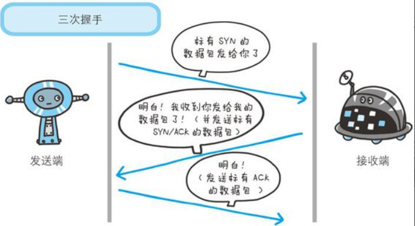
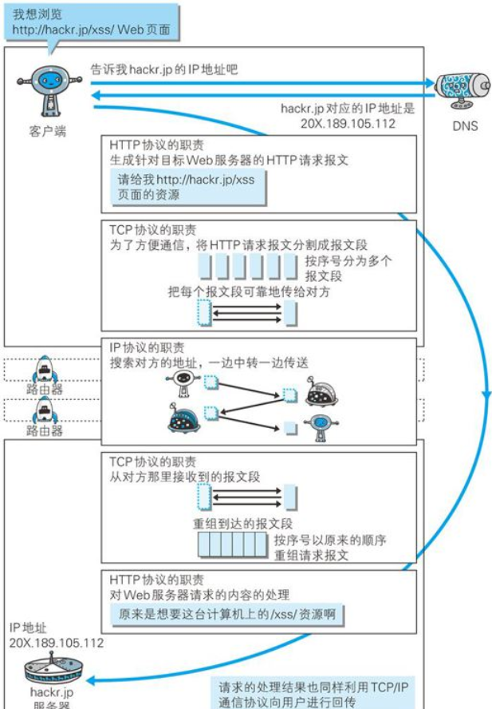

#### TCP/IP 分层
TCP/IP协议按层分为以下四层
1. 应用层
    > 向用户提供应用服务时通讯的活动。
    TCP/IP协议内预存了各类通用的应用服务：
    FTP(文件传输协议)、DNS(域名系统)、HTTP(超文本传输协议)
2. 传输层
    > 传输层对上层应用层，提供处于网络连接中的两台计算机之间的数据传输。
    在传输层有两个性质不同的协议：TCP(传输控制协议)和UDP(用户数据报协议)
    
    注：UDP 是一个面向报文（报文可以理解为一段段的数据）的协议。意思就是 UDP 只是报文的搬运工，不会对报文进行任何拆分和拼接操作。

    具体来说：
    > 1. 在发送端，应用层将数据传递给传输层的 UDP 协议，UDP 只会给数据增加一个 UDP 头标识下是 UDP 协议，然后就传递给网络层了
    > 2. 在接收端，网络层将数据传递给传输层，UDP 只去除 IP 报文头就传递给应用层，不会任何拼接操作.

   不可靠性:
    > 1. UDP 是无连接的，也就是说通信不需要建立和断开连接。
    > 2. UDP 也是不可靠的。协议收到什么数据就传递什么数据，并且也不会备份数据，对方能不能收到是不关心的
    > 3. UDP 没有拥塞控制，一直会以恒定的速度发送数据。即使网络条件不好，也不会对发送速率进行调整。这样实现的弊端就是在网络条件不好的情况下可能会导致丢包，但是优点也很明显，在某些实时性要求高的场景（比如电话会议）就需要使用 UDP 而不是 TCP。

    高效：
    > 1. 因为 UDP 没有 TCP 那么复杂，需要保证数据不丢失且有序到达。所以 UDP 的头部开销小，只有八字节，相比 TCP 的至少二十字节要少得多，在传输数据报文时是很高效的。

    传输方式：
    > 1. UDP 不止支持一对一的传输方式，同样支持一对多，多对多，多对一的方式，也就是说 UDP 提供了单播，多播，广播的功能。

3. 网络层
    > 网络层用来处理在网络上流动的数据包。数据包是网络传输的最小数据单位
4. 链路层 (又名数据链路层、网络接口层)
    > 用来处理连接网络的硬件部分，包括控制操作系统、硬件的设备驱动、
    NIC(Network interface Card，网络适配器，即网卡)以及光纤等物理可见部分(还包括连接器等一切传输媒介)。硬件上的范畴均在链路层的作用范围之内。

#### TCP/IP 通讯传输流

发送端在层与层之间传输数据时，没经过一层时必定会被打上一个改成所属的首部信息，反之接收端在层与层传输数据时，没经过一层时会把对应的首部去掉

#### Tcp 三次握手
为了准确无误地将数据送达目标处，TCP协议采用了三次握手(three-way handsshaking)策略。
握手过程中使用了TCP的标志(flag) —— SYN(synchronize) 和 ACK(ackno wledgement).
发送端首先发送一个带SYN标志的数据包给对方。接收端收到后，回传一个带有SYN/ACK标志的数据包
以示传达确认信息。最后发送端回传一个带有ACK标志的数据包，代表“握手”结束。
若在握手过程中某个阶段莫名中断，TCP协议会再次以相同的顺序发送相同的数据包。
除了上次三次握手，TCP协议还有其他手段来保证通信的可靠性。

下面是HTTP协议与TCP协议，IP协议以及DNSw服务在使用中的关系和作用

