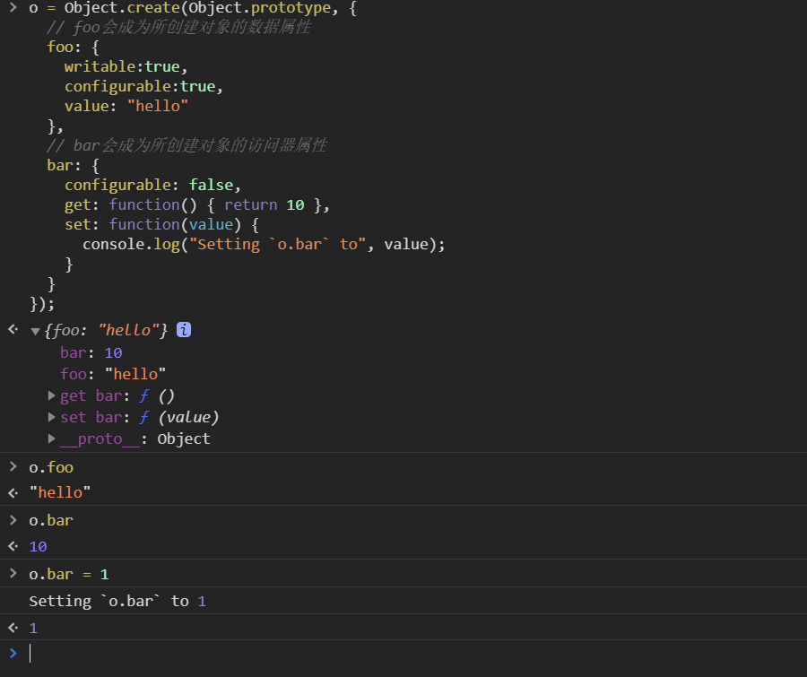
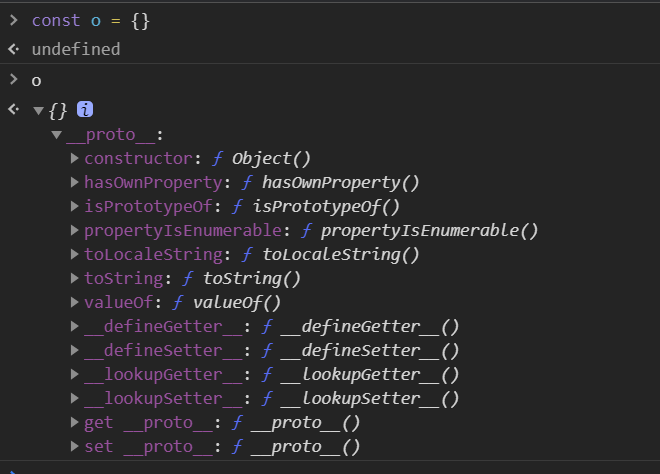
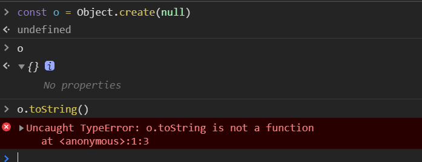
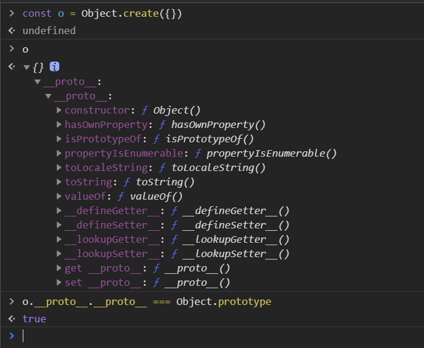
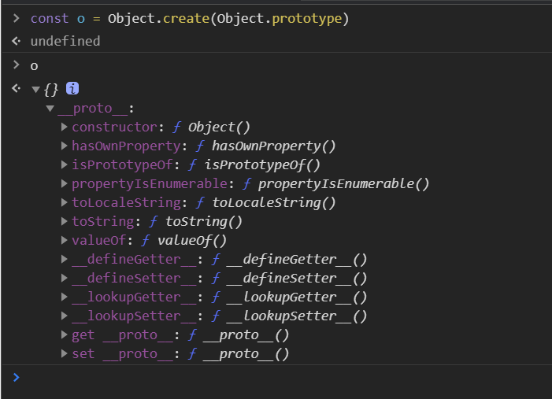

### Object.create

1. Object.create 的作用？
   `Object.create()`方法创建一个新对象，使用现有的对象来提供新创建的对象的**proto**。 说白了就是基于现有对象的**proto**创建一个对象。
   > Object.create(proto, [propertiesObject])

- proto: 新创建对象的原型对象
- propertiesObject： 可选。要添加到新对象的**可枚举**(新添加的属性是自身的属性，而不是其原型链上的属性)的属性

```javascript
const obj = Object.create(Object.prototype, {
  // foo会成为新创建对象的数据属性
  foo: {
    writable: true,
    configurable: true,
    value: "this is foo",
  },
  // bar会成为所创建对象的访问器属性
  bar: {
    configurable: false,
    get: function () {
      return 10;
    },
    set: function (value) {
      console.log("Setting to ", value);
    },
  },
});
```

 2. Object.create 和 {...}的区别？

```javascript
const o = {};
```

先看下常用的`{}`对象



自身是没有属性的，但是它的原型对象`__proto__`继承了`Object`的各种方法，

来看看`Object.create()`创建的对象

```javascript
const o = Object.create(null);
```



通过`Object.create(null)`创建的对象，对象没有任何的属性

再来看看`Object.create({})`创建的对象

```javascript
const o = Object.create({});
```



这里可以看出创建的对象已经跟`{}`很像了，只不过是多了层`__proto__`,这是因为`{}`实例也是通过`__proto__`继承`Object.prototype`的方法，所以这里`o.__proto__.__proto__ === Object.prototype` 是正确的。



3. 使用场景？
  - 创建一个纯净的对象`Object.create(null)`,自己可以定义想要的方法，如`toString` 等
  - 复制一份目标对象的方法,而后在修改自身对象时避免污染源对象`Object.create(Array.prototype)`
4. 如何实现一个 Object.create
