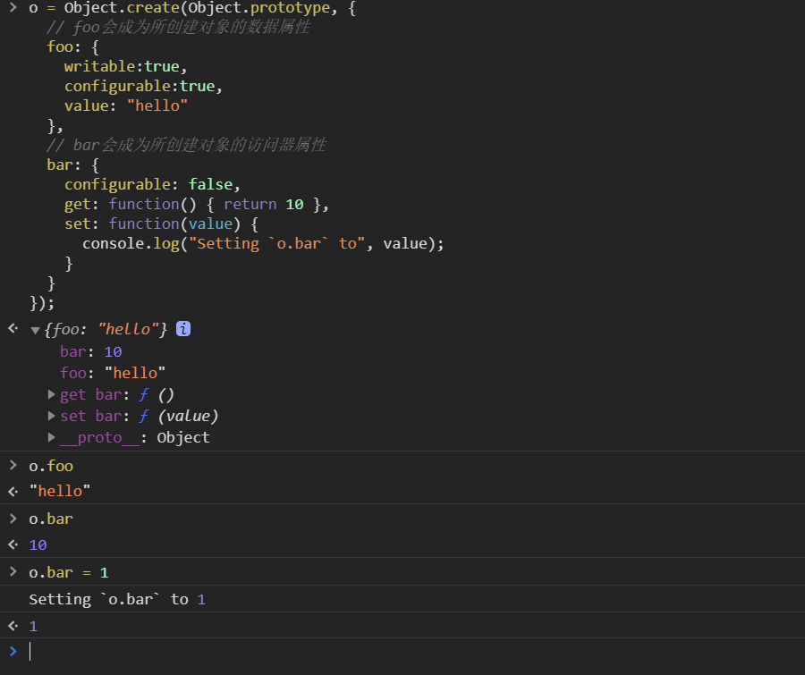
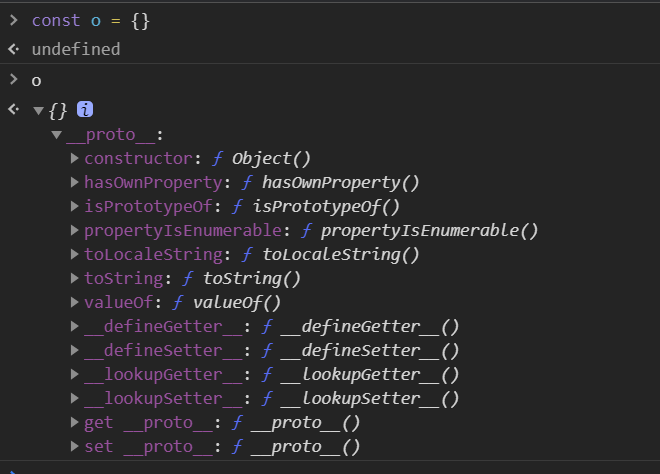
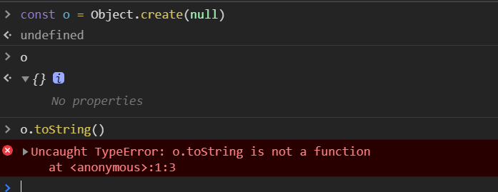
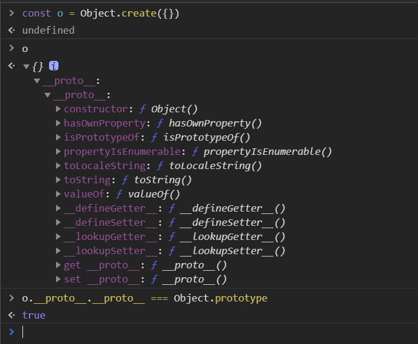
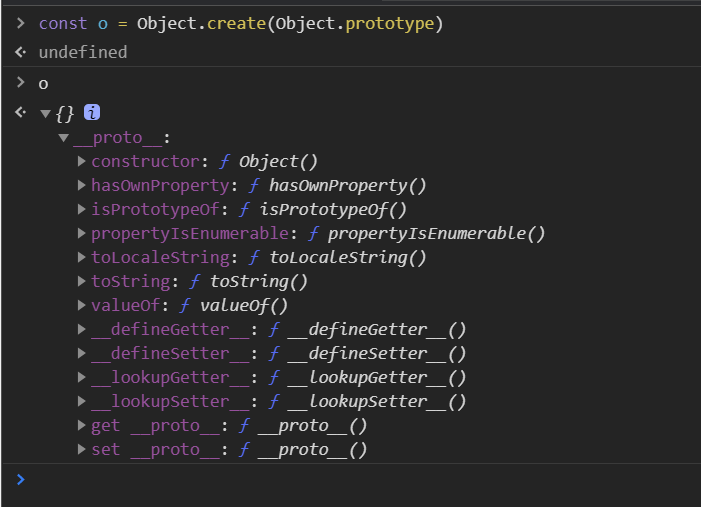
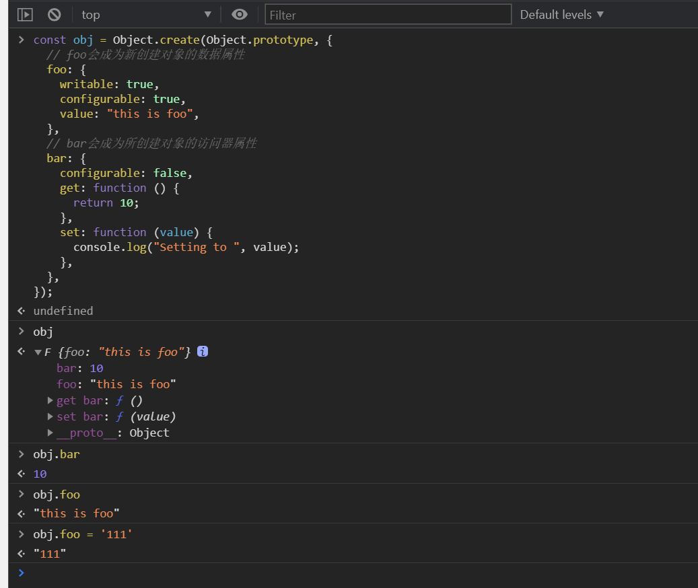

### Object.create

#### Object.create 的作用？

`Object.create()`方法创建一个新对象，使用现有的对象来提供新创建的对象的`__proto__`。 说白了就是基于现有对象的`__proto__`创建一个对象。

> Object.create(proto, [propertiesObject])

- proto: 新创建对象的原型对象
- propertiesObject： 可选。要添加到新对象的**可枚举**(新添加的属性是自身的属性，而不是其原型链上的属性)的属性

```javascript
const obj = Object.create(Object.prototype, {
  // foo会成为新创建对象的数据属性
  foo: {
    writable: true,
    configurable: true,
    value: "this is foo",
  },
  // bar会成为所创建对象的访问器属性
  bar: {
    configurable: false,
    get: function () {
      return 10;
    },
    set: function (value) {
      console.log("Setting to ", value);
    },
  },
});
```



#### Object.create 和 {...}的区别？

```javascript
const o = {};
```

先看下常用的`{}`对象



自身是没有属性的，但是它的原型对象`__proto__`继承了`Object`的各种方法，

来看看`Object.create()`创建的对象

```javascript
const o = Object.create(null);
```



通过`Object.create(null)`创建的对象，对象没有任何的属性

再来看看`Object.create({})`创建的对象

```javascript
const o = Object.create({});
```



这里可以看出创建的对象已经跟`{}`很像了，只不过是多了层`__proto__`,这是因为`{}`实例也是通过`__proto__`继承`Object.prototype`的方法，所以这里`o.__proto__.__proto__ === Object.prototype` 是正确的。



#### 使用场景？

- 创建一个纯净的对象`Object.create(null)`,自己可以定义想要的方法，如`toString` 等
- 复制一份目标对象的方法,而后在修改自身对象时避免污染源对象`Object.create(Array.prototype)`

```javascript
例如Vue源码在处理数组响应式的时候,
  针对数组方法做了修改,
  就是用到了Object.create;

const arrayProto = Array.prototype;
创建一个新的数组对象, 修改该对象的数组的七个方法, 防止污染原生数组方法;
const arrayMethods = Object.create(arrayProto)
[("push", "pop", "shift", "unshift", "splice", "sort", "reverse")].forEach(
  (method) => {
    /*将数组的原生方法缓存起来，后面要调用*/
    const original = arrayProto[method];
    def(arrayMethods, method, function mutator() {
      // avoid leaking arguments:
      // http://jsperf.com/closure-with-arguments
      let i = arguments.length;
      const args = new Array(i);
      while (i--) {
        args[i] = arguments[i];
      }
      /*调用原生的数组方法*/
      const result = original.apply(this, args);

      /*数组新插入的元素需要重新进行observe才能响应式*/
      const ob = this.__ob__;
      let inserted;
      switch (method) {
        case "push":
          inserted = args;
          break;
        case "unshift":
          inserted = args;
          break;
        case "splice":
          inserted = args.slice(2);
          break;
      }
      if (inserted) ob.observeArray(inserted);

      // notify change
      /*dep通知所有注册的观察者进行响应式处理*/
      ob.dep.notify();
      return result;
    });
  }
);
```

#### 如何实现一个 Object.create
`Object.create` 是ES6的方法, ES5及以下是无法使用的, 那么就需要实现一个polyfill吧.
```JavaScript

Object.create = (proto, propertiesObject) => {
  // 属性为null,抛出异常
  if (propertiesObject === null) throw 'TypeError'
  function F () {}
  // 指定原型对象
  F.prototype = proto
  const o = new F()
  // 这里是第二个选项, 添加属性
  if (typeof propertiesObject !== 'undefined') {
    Object.defineProperties(o, propertiesObject)
  }
  // 如果proto 为null,需要去除__proto__,实现纯净的map
  if (proto === null) o.__proto__ = null
  // 返回新的对象
  return o
}

```
