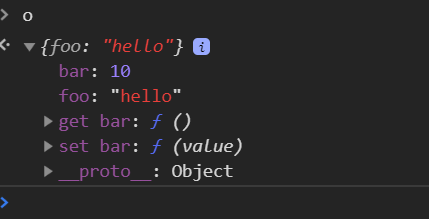

### Object.create、new Object、{}的区别

先来介绍下 Object.create

Object.create()方法创建一个新对象，使用现有的对象来提供新创建的对象的__proto__。

> `__proto__` 实例对象的原型, 例如 
> var o = {}; ```o.__proto__ === Object.prototype ```

##### 语法
> Object.create(proto, [propertiesObject])

参数：

```proto``` 新创建对象的原型对象。

```propertiesObject```: 可选。如果没有指定为 `undefined`，则是要添加到新创建对象的可枚举属性（即其自身定义的属性，而不是其原型链上的枚举属性）对象的属性描述符以及相应的属性名称。这些属性对应`Object.defineProperties()`的第二个参数。

返回值：一个新对象，带着指定的原型对象和属性。

```javascript

// Shape - 父类(superclass)
function Shape() {
  this.x = 0;
  this.y = 0;
}

// 父类的方法
Shape.prototype.move = function(x, y) {
  this.x += x;
  this.y += y;
  console.info('Shape moved.');
};

// Rectangle - 子类(subclass)
function Rectangle() {
  Shape.call(this); // call super constructor.
}

// 子类续承父类
Rectangle.prototype = Object.create(Shape.prototype);
Rectangle.prototype.constructor = Rectangle;

var rect = new Rectangle();

console.log('Is rect an instance of Rectangle?', rect instanceof Rectangle); // true
console.log('Is rect an instance of Shape?', rect instanceof Shape); // true
rect.move(1, 1); // Outputs, 'Shape moved.'

```

Object.create 的 propertyObject参数

```javascript

var o = Object.create(Object.prototype, {
  foo: {
    writable:true,
    configurable:true,
    value: "hello" 
  },
  bar: {
    configurable: false,
    get: function() { return 10 },
    set: function(value) {
      console.log("Setting `o.bar` to", value);
    }
  }
})

```


1. 创建一个空对象
```javascript

const o = Object.create(null)
const o1 = {}
const o2 = new Object()

o // {} No Properties
o1 // {}
o2 // {}

o 不继承Object任何属性，方法, 包括原型链上的
o.__proto__ // undefiend 对象实例 没有任何的属性

o1, o2 继承 Object原型的属性，方法
o.__proto__ === o1.__proto__ // false
o.__proto__ === o2.__proto__ // false
o1.__proto__ === o2.__proto__ // true
o1 和 o2 实例对象 的原型都指向同一个 Object.prototype
o1.__proto__ === Object.prototype
o2.__proto__ === Object.prototype

如果想要o同样继承Object.prototype属性，方法
const o = Object.create(Object.prototype)

o.__proto__ === o1.__proto__ // true
o.__proto__ === o2.__proto__ // true
o.__proto__ === Object.prototype // true

```
2. 创建有值对象

```javascript

const o = Object.create({x: 1, y: 2})
const o1 = {x: 1, y: 2}
const o2 = new Object({x: 1, y: 2})

o // {}
o.__proto__ // {x: 1, y: 2}
o.__proto__.x // 1

o1 // {x: 1, y: 2}
o1.__proto__ // {constructor: f, ...}
o1.__proto__.x  // undefiend

o2 // {x: 1, y: 2}
o2.__proto__ // {constructor: f, ...}
o2.__proto__.x // undefined

这里可以大概率推出：Object.create() 会将对象继承到__proto__属性上。
```

