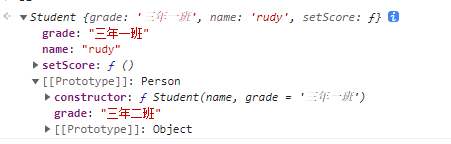

# Javascript 常见的几种继承方式。

## 原型链继承

这种方式关键在于：**子类型的原型为父类型的一个实例对象**

```javascript
// 父类型
function Person(name, age) {
  this.name = name;
  this.age = age;
  this.doc = [];
  this.getName = function () {};
}

Person.prototype.getAge = function () {};

// 子类型
function Student(price) {
  this.price = price;
  this.getNums = function () {};
}

Student.prototype = new Person(); // 子类型的原型为父类型的实例对象

var s1 = new Student(100);
var s2 = new Student(200);
```

这种方式实现的本质是把子类的原型指向了父类的实例，因此**子类的实例是可以通过**proto**去访问 Student.prototype 也就是父类 Person 的实例，这样就可以访问到父类的私有方法和属性，如果想再要访问 Person 的私有方法，就可以把**proto**指向父类 Person.prototype 就可以获取到父类原型上的方法(即 Person 的私有方法)**。于是做到了将父类的私有、共有方法和属性都当作子类的共有属性。

**子类继承父类的属性和方法是将父类的私有属性和共有方法都作为自己的共有属性和方法**。如果父类的私有属性是引用类型的属性，那么它被子类继承后作为共有属性，当子类在操作这个属性时候，就会影响到其他的子类。

```javascript
function Person(name, age) {
  (this.name = name), (this.age = age);
}
Person.prototype.setAge = function () {
  console.log("111");
};
function Student(price) {
  this.price = price;
  this.setScore = function () {};
}
// Student.prototype.sayHello = function () { }//在这里写子类的原型方法和属性是无效的，
//因为会改变原型的指向，所以应该放到重新指定之后
Student.prototype = new Person();
Student.prototype.sayHello = function () {};
var s1 = new Student(15000);
console.log(s1);
```

### 特点：

- 父类新增原型方法/原型属性，子类都能访问到
- 简单，易于实现

### 缺点：

- 无法实现多继承
- 来自原型对象的所有属性被所有实例共享
- 创建子类实例时，无法向父类构造函数传参
- 要想为子类新增属性和方法，必须要在 Student.prototype = new Person() 之后执行，不能放到构造器中

<!-- https://segmentfault.com/a/1190000016708006 -->

## 借用构造函数继承

这种方式关键在于：**在子类型构造函数中通过 call()调用父类型构造函数**

```javascript
function Person(name, age) {
  this.name = name;
  this.age = age;
  this.getName = function () {};
}

Person.prototype.setAge = function () {};

function Student(name, age, price) {
  Person.call(this, name, age);
  this.price = price;
}

var s1 = new Student("Rudy", 30, 13333);
```

这种方式只是实现部分的继承，如果父类的原型还有方法和属性，子类是拿不到这些方法和属性的。

### 特点：

- 解决了原型链继承中子类实例共享父类引用属性的问题
- 创建子类实例时，可以向父类传递参数
- 可以实现多继承(call 多个父类对象)

### 缺点：

- 实例并不是父类的实例，只是子类的实例
- 只能继承父类的实例属性和方法，不能继承原型属性和方法
- 无法实现函数复用，每个子类都有父类实例函数的副本，影响性能

## 组合继承
```javascript

function Person(grade) {
  this.grade = grade
}

Person.prototype.setAge = function () {
  console.log('setAge')
}

function Student(name, grade = '三年一班') {
  Person.call(this, grade)
  this.name = name
  this.setScore = function () {}
}

Student.prototype = new Person("三年二班")
Student.prototype.constructor = Student

var s1 = new Student("rudy")
console.log(s1)


```



在上面的实例`s1`中可以找到`Student` 自有属性`name` 和 继承`Person`的属性`grade`，但是上一层原型链上还有个`grade`属性，这就有问题了，按道理来说实例已经继承了属性，原型上就不应该再出现。问题出现在`new Person('三年二班)`这里，这里的目的是继承原型上的属性和方法，其实没有必要实例化，完全可以用`Object.create(Person.prototype)`来继承原型的属性和方法。接下来在下面**寄生组合继承**去解决这个问题。
## 寄生组合继承

**借助原型可以基于已有的对象来创建对象，`var B = Object.create(A)`以 A 对象为原型，生成 B 对象。B 继承了 A 所有的属性和方法**

```javascript
function Person(name, age) {
  this.name = name;
  this.age = age;
}

Person.prototype.setAge = function () {
  console.log("setAge");
};

function Student(name, age, price) {
  Person.call(this, name, age); // 继承Person的共有属性、方法
  this.price = price;
  this.setScore = function () {};
}

Student.prototype = Object.create(Person.prototype); // 继承Person.prototype 的方法和属性
Student.prototype.constructor = Student; // 把构造函数指向Student
var s1 = new Student("Rudy", 10, 100);
```

## ES6 中的 class 的继承

ES6 中引入了 class 关键字，class 可以通过 extends 关键字实现继承，还可以通过 static 关键字定义类的静态方法,这比 ES5 的通过修改原型链实现继承，要清晰和方便很多。
ES5 的继承，实质是先创造子类的实例对象 this，然后再将父类的方法添加到 this 上面（Parent.apply(this)）。ES6 的继承机制完全不同，实质是先将父类实例对象的属性和方法，加到 this 上面（所以必须先调用 super 方法），然后再用子类的构造函数修改 this。
**需要注意的是，class 关键字只是原型的语法糖，JavaScript 继承仍然是基于原型实现的。**

```javascript
class Person {
  // 调用类的构造方法
  constructor(name, age) {
    this.name = name;
    this.age = age;
  }

  // 定义一般的方法
  showName() {
    console.log("调用父类的方法");
    console.log(this.name, this.age);
  }
}

class Student extends Person {
  constructor(name, age, salary) {
    super(name, age); // 通过super调用父类的构造方法, 猜测类似Person.call(name, age)
    this.salary = salary;
  }

  // 在子类自身定义方法
  showName() {
    console.log("调用子类的方法");
    console.log(this.name, this.age, this.salary);
  }
}
```
