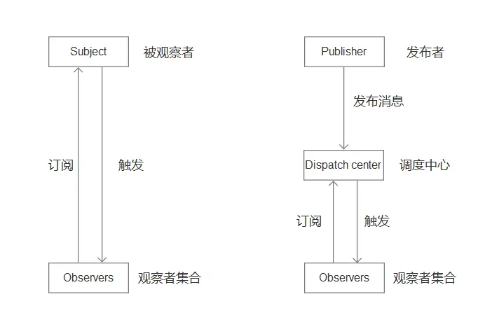

## 观察者/发布订阅者模式

### 什么叫观察者模式？官方定义的是：
` 定义对象间的一种一对多的依赖关系，当一个对象的状态发生变化时，所有依赖于它的对象都将得到通知并被自动更新。` 
其实就是当目标对象属性发生了变化，所有依赖于目标对象的观察者都将收到通知。

```javascript

// 目标对象
class Subject {
  constructor () {
    this.observers = []
  }

  // 添加观察者
  add (observer) {
    return this.observers.push(observer)
  }

  // 移除观察者
  remote (observer) {
    this.observers = this.observers.filter(e => e !== observer)
  }

  // 发送消息,通知观察者
  notify () {
    this.observers.forEach(item => item.update())
  }
}

// 观察者对象
class Observer {
  constructor (name) {
    this.name = name
  }

  // 更新通知
  update () {
    console.log(`my name is ${this.name}`)
  }
}

const sub = new Subject()
const obs1 = new Observer('rudy')
const obs2 = new Observer('kobe')
sub.add(obs1)
sub.add(obs2)
sub.notify()
// my name is rudy
// my name is kobe


```

### 发布订阅这模式：
就像孩子们在学校一样，有很多科目老是，每个科目老师就相当于一个发布者，一群孩子就相当于订阅者，每一个老师都是一个不同的实例函数，在发布任务和作业的时候都不会影响到其他人。

```javascript
class Subject {
  constructor () {
    // 主题列表
    this.observers = {}
  }

  // 添加订阅
  on (key, fn) {
    if (!this.observers[key]) {
      this.observers[key] = []
    }

    this.observers[key].push(fn)
  }

  // 取消订阅
  off (key) {
    delete this.observers[key]
  }

  // 发布通知
  emit (key, params) {
    if (!this.observers[key]) return

    const arr = this.observers[key]
    // 执行
    arr.forEach(item => item(params))
  }
}

// 单独一个主题
const sub = new Subject()

sub.on('math', (sub) => {
  console.log(`我正在上${sub}课`)
})

sub.on('english', (sub) => {
  console.log(`我正在上${sub}课`)
})

sub.emit('math', '数学') // 我正在上数学课
sub.emit('english', '英语') // 我正在英语课


```

### 两者模式的区别
- 发布订阅者模式相对于观察者模式中间多了个消息管理器，使得发布者和订阅者的耦合性更加小。
- 观察者模式通常用于`同步`场景，而发布订阅者模式通常用于`异步`场景(监听回调)


盗图~~~