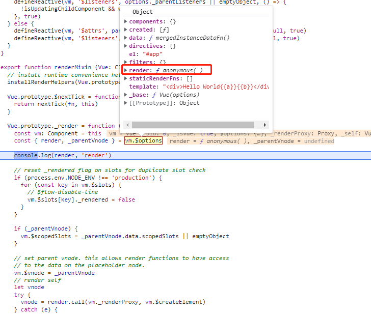
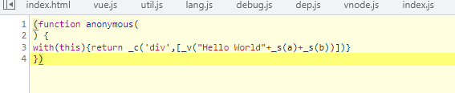
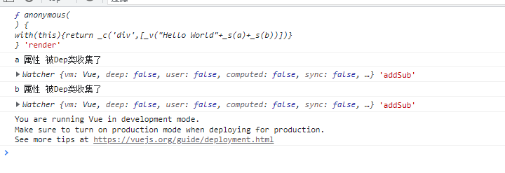

# Vue data 中随意更改一个属性，视图都会被更新吗？

面试官：看过 Vue 的源码没？
候选者：看过。
面试官：那你说下 **Vue data 中随意更改一个属性，视图都会被更新吗？**
候选者：不会。
面试官：why?
候选者：如果该属性没有被用到 template 中，就没有必要去更新视图，频繁这样性能不好。
面试官：那 Vue 中是如何去实现该方案的？
候选者：在实例初始化过程中，利用`Object.defineProperty`对 data 中的属性进行数据监听，如果在 template 中被使用到的属性，就被 Dep 类收集起来，等到属性被更改时会调用`notify`更新视图。
面试官：那你怎么知道那些属性是在 template 被用到的呢？
候选者：WTF。。。这个倒不是很清楚，您能解释下吗？
面试官：OK，那我就简单解释下：

先写个简单的 demo，其中 data 中有 4 个属性`a,b,c,d`，在模板中被利用到的属性只有`a,b`。看看是不是只有`a,b`才会调用`Dep`收集起来呢？

```javascript
new Vue({
  el: '#app',
  data() {
    return {
      a: 1,
      b: 2,
      c: 3,
      d: 4,
    };
  },
  created() {
    console.log(this.b);
    this.b = 'aaa';
  },
  template: '<div>Hello World{{a}}{{b}}</div>',
});
```

1. 首先在初始化时会利用`proxy`把每个属性都 代理一遍

```javascript
proxy(vm, `_data`, key);
```

2. 然后需要对每个对象的属性进行监听, 先遍历每个属性，利用`defineReactive` 进行拦截

```javascript
observe(data, true /* asRootData */);

// observe
const keys = Object.keys(obj);
for (let i = 0; i < keys.length; i++) {
  defineReactive(obj, keys[i]);
}

// defineReactive
Object.defineProperty(obj, key, {
  enumerable: true,
  configurable: true,
  get: function reactiveGetter() {
    const value = getter ? getter.call(obj) : val;
    // 重点在这里，后续如果在模板中使用到的属性，都会被执行reactiveGetter函数
    // 被Dep类 收集起来
    if (Dep.target) {
      console.log(`${key} 属性 被Dep类收集了`)
      dep.depend();
      if (childOb) {
        childOb.dep.depend();
        if (Array.isArray(value)) {
          dependArray(value);
        }
      }
    }
    return value;
  },
  set: function reactiveSetter(newVal) {
    const value = getter ? getter.call(obj) : val;
    /* eslint-disable no-self-compare */
    if (newVal === value || (newVal !== newVal && value !== value)) {
      return;
    }
    if (setter) {
      // 这里是处理computed set 函数
      setter.call(obj, newVal);
    } else {
      val = newVal;
    }
    childOb = !shallow && observe(newVal);
    // 如果我们在更改属性时，就会调用notify 异步更新视图
    dep.notify();
  },
});
```

3. 执行`$mount`进行视图挂载

```javascript
if (vm.$options.el) {
  vm.$mount(vm.$options.el);
}
```

4. `$mount` 是调用 Vue 原型上的方法, 重点是最后一句 ` mount.call(this, el, hydrating)`

```javascript
Vue.prototype.$mount = function (
  el?: string | Element,
  hydrating?: boolean
): Component {
  el = el && query(el);

  const options = this.$options;
  // resolve template/el and convert to render function
  /**
   * 查看render 函数是否存在？如果不存在就解析template模板
   * Vue渲染页面时，有两个方式 1. template，2. render，最终所有的模板类的都需要使用render去渲染
   */
  if (!options.render) {
    let template = options.template;
    if (template) {
      if (typeof template === 'string') {
        if (template.charAt(0) === '#') {
          template = idToTemplate(template);
          /* istanbul ignore if */
          if (process.env.NODE_ENV !== 'production' && !template) {
            warn(
              `Template element not found or is empty: ${options.template}`,
              this
            );
          }
        }
      } else if (template.nodeType) {
        template = template.innerHTML;
      } else {
        if (process.env.NODE_ENV !== 'production') {
          warn('invalid template option:' + template, this);
        }
        return this;
      }
    } else if (el) {
      // 如果模板不存在，就创建一个默认的html模板
      template = getOuterHTML(el);
    }
  }
  // 重写了Vue.prototype.$mount ，最终调用缓存的mount方法完成对$mount的挂载
  return mount.call(this, el, hydrating);
};
```

5. 这里`mount`调用了 `mountComponent(this, el, hydrating)` 方法，而 `mountComponent`是执行了
   `_render`函数,最终`_render`是调用`render` 生成一个`vnode`。

```javascript
const { render, _parentVnode } = vm.$options;
vnode = render.call(vm._renderProxy, vm.$createElement);
```





最后一张图可以看到是`render`函数在渲染我们demo里面的`template`模板，最终只有`a, b`两个属性才会被`Dep`类收集起来。




如果文中有错误的地方，麻烦各位指出，我会持续改进的。谢谢，
需要调试源码的，这里点击[这里](https://github.com/Rudy24/Notes/tree/master/Vue%E6%BA%90%E7%A0%81%E5%AD%A6%E4%B9%A0/projects/demo1)，按照 readme操作即可。希望star下。谢谢