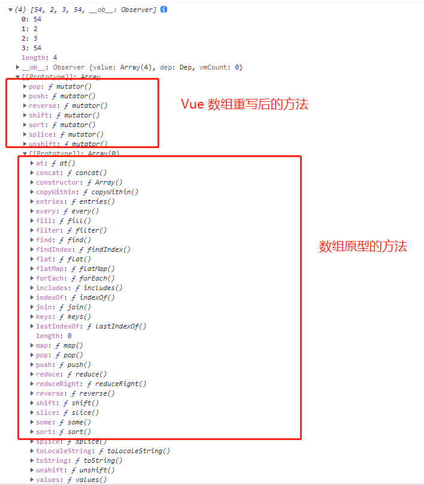
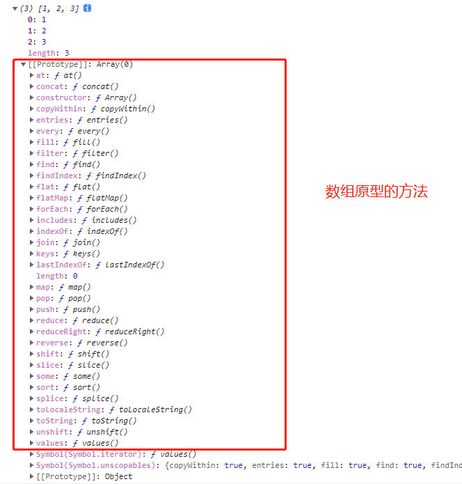

<!--
 * @Author: 宋绍华
 * @Date: 2021-12-25 09:56:24
 * @LastEditTime: 2021-12-25 15:06:57
 * @LastEditors: 宋绍华
 * @Description:
 * @FilePath: \Notes\Vue源码学习\Vue 数组是如何做到.md
-->

# Vue 数组中是如何做到响应式更新视图的？

- 面试官：**[Vue data 中随意更改一个属性 视图更新的问题清楚了吧？](https://juejin.cn/post/7040733315791323143)**
- 候选者：茅塞顿开。
- 面试官：嗯，清楚就好。那咱们聊下个问题吧
- 面试官：你能说下 **Vue 数组中是如何做到响应式更新视图的？**
- 候选者：利用函数`defineReactive`对每个属性进行响应式拦截，然后对数组的一些方法进行了重写，下次调用数组
  方法的时候，就执行另外一套逻辑了。
- 面试官：嗯，那 Vue 如何重写的数组？
- 候选者：Vue 利用`Object.defineProperty`把 数组`push, pop, shift, unshift, splice, sort, reverse` 重写了。
- 面试官：能具体些吗？另外 Vue 重写了数组的一些方法，那它是如何保证不污染其他 js 里面的数组呢？
- 候选者：WTF。。。这个细节记得不是很清楚了，您能解释下吗？
- 面试官：OK，那我就简单解释下。 (心里：这小子真是来面试的吗？还是来白嫖我的知识？)

还是用[上篇文章](https://juejin.cn/post/7040733315791323143)的例子来说吧。

```javascript
// 非响应式数组
const list2 = [1, 2, 3];
new Vue({
  el: '#app',
  data() {
    return {
      list: [1, 2, 3],
    };
  },
  methods: {
    add() {
      const k = Math.floor(Math.random() * 100);
      console.log(list2, '非响应式数组')
      if (!this.list.includes(k)) {
        this.list.push(k);
        this.list[0] = k;
        console.log(this.list);
      } else {
        console.log(`${k} 重复了`);
      }
    },
  },
  template: `
              <div>
                <button @click='add'>add</button>
                <div v-for='n in list' :key='n'>{{n}}</div>
                <div>访问单个属性{{list}}</div>
              </div>
              `,
});
```

在`Observer`类中，有个判断，如果该属性为**数组**的话，就会进入执行重写步骤了。

```javascript
export class Observer {
  value: any;
  dep: Dep;
  vmCount: number; // number of vms that has this object as root $data

  constructor(value: any) {
    this.value = value;
    this.dep = new Dep();
    this.vmCount = 0;
    def(value, '__ob__', this);
    // 处理数组原型上面的方法
    if (Array.isArray(value)) {
      // 这里判断是否支持__proto__属性
      const augment = hasProto ? protoAugment : copyAugment;
      // 重点：修改数组原型上的方法
      augment(value, arrayMethods, arrayKeys);
      // 处理数组深层次响应式
      this.observeArray(value);
    } else {
      // 如果是非数组，直接走响应式
      this.walk(value);
    }
  }

  /**
   * Walk through each property and convert them into
   * getter/setters. This method should only be called when
   * value type is Object.
   */
  walk(obj: Object) {
    const keys = Object.keys(obj);
    for (let i = 0; i < keys.length; i++) {
      defineReactive(obj, keys[i]);
    }
  }

  /**
   * Observe a list of Array items.
   */
  observeArray(items: Array<any>) {
    for (let i = 0, l = items.length; i < l; i++) {
      observe(items[i]);
    }
  }
}
```

如果存在对象上存在`__proto__`，就通过`__proto__`去修改该数组的原型 ` const augment = hasProto ? protoAugment : copyAugment;`，
这里也就解释了，**那它是如何保证不污染其他 js 里面的数组呢？**

然后去重写数组原型的一些方法`augment(value, arrayMethods, arrayKeys);`。

```javascript
// 判断对象中是否存在__proto__属性
export const hasProto = '__proto__' in {};
// 获取自有属性名称 关于 [[Object.getOwnPropertyNames]()](https://developer.mozilla.org/zh-CN/docs/Web/JavaScript/Reference/Global_Objects/Object/getOwnPropertyNames)
const arrayKeys = Object.getOwnPropertyNames(arrayMethods);

// 数组原型
const arrayProto = Array.prototype;
// 获取数组原型上的方法
export const arrayMethods = Object.create(arrayProto);

// 处理数组原型上面的方法
if (Array.isArray(value)) {
  // 这里判断是否支持__proto__属性
  const augment = hasProto ? protoAugment : copyAugment;
  // 重点：修改数组原型上的方法
  augment(value, arrayMethods, arrayKeys);
  // 处理数组深层次响应式
  this.observeArray(value);
}

// 重写原型
function protoAugment(target, src: Object, keys: any) {
  /* eslint-disable no-proto */
  target.__proto__ = src;
  /* eslint-enable no-proto */
}

/**
 * Augment an target Object or Array by defining
 * hidden properties.
 */
/* istanbul ignore next */
function copyAugment(target: Object, src: Object, keys: Array<string>) {
  for (let i = 0, l = keys.length; i < l; i++) {
    const key = keys[i];
    def(target, key, src[key]);
  }
}
```

重头戏来了，Vue 是如何重写数组的 `push, pop, shift, unshift, splice, sort, reverse` 七个方法。

1. 获取数组的原型`const arrayProto = Array.prototype`
2. 获取新对象的原型对象 `const arrayMethods = Object.create(arrayProto)`
3. 遍历需要修改的方法`methodsToPatch`
4. 利用`Object.defineProperty` 重新劫持数组的方法
5. 注意还需要把新插入的数据 响应式 `if (inserted) ob.observeArray(inserted)`
6. 最后手动通知更新视图 `ob.dep.notify()`

```javascript
import { def } from '../util/index';

// 数组原型
const arrayProto = Array.prototype;
// 获取新对象的原型对象
export const arrayMethods = Object.create(arrayProto);

// 需要修改的一些方法
const methodsToPatch = [
  'push',
  'pop',
  'shift',
  'unshift',
  'splice',
  'sort',
  'reverse',
];

/**
 * Intercept mutating methods and emit events
 */
methodsToPatch.forEach(function (method) {
  // cache original method
  const original = arrayProto[method];
  // 利用Object.defineProperty 重新劫持数组的方法
  def(arrayMethods, method, function mutator(...args) {
    // 利用数组的方法执行
    const result = original.apply(this, args);
    const ob = this.__ob__;
    let inserted;
    switch (method) {
      case 'push':
      case 'unshift':
        inserted = args;
        break;
      case 'splice':
        inserted = args.slice(2);
        break;
    }
    // 被插入的数据也需要转化为响应式
    if (inserted) ob.observeArray(inserted);
    // notify change
    // 手动更新视图
    ob.dep.notify();
    return result;
  });
});

export function def(obj: Object, key: string, val: any, enumerable?: boolean) {
  Object.defineProperty(obj, key, {
    value: val,
    enumerable: !!enumerable,
    writable: true,
    configurable: true,
  });
}
```

以上我们可以看到Vue data 中的数组原型上的某些方法被重写了，因此在执行操作的时候，首先是会拿到这些重写后的方法，
但是非Vue data 中的方法还是继续可以使用数组原型的方法，就不存在污染一说了。

最后来看下Vue data 中的数组和非data 中的数组的一些区别吧。





如果文中有错误的地方，麻烦各位指出，我会持续改进的。谢谢，
需要调试源码的，这里点击[这里](https://github.com/Rudy24/Notes/tree/master/Vue%E6%BA%90%E7%A0%81%E5%AD%A6%E4%B9%A0/projects/demo1)，按照 readme操作即可。希望star下。谢谢