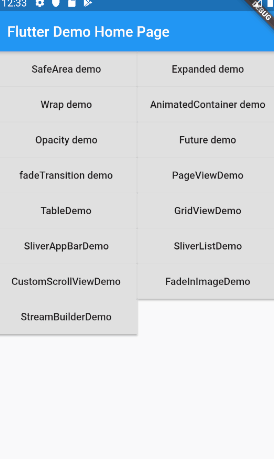

# StreamBuilder -- 文件流异步更新 UI

许多时候我们更新 UI 需要依靠异步数据,比如初始化一个列表之类，为了更好的体验，通常需要在数据加载完之前展示个 loading，
提示正在更新数据。Flutter 为我们提供了`FutureBuilder`和`StreamBuilder`来实现这种功能。

我们先来看看 `StreamBuilder`

```javascript

StreamBuilder({
  Key key,
  this.initialData,
  Stream<T> stream,
  @required this.builder,
})
```

- `initialData`: 用户设置的初始化数据。
- `stream`: 用于接收异步事件数据。
- `builder`: Widget 构建器，该构建器会在`Stream`执行的不同阶段被多次调用。

```javascript

import 'package:flutter/cupertino.dart';
import 'package:flutter/material.dart';

class StreamBuilderDemo extends StatelessWidget {
  Stream<int> counter() {
    return Stream.periodic(Duration(seconds: 1), (i) {
      return i;
    });
  }

  @override
  Widget build(BuildContext context) {
    return Scaffold(
      appBar: AppBar(
        title: const Text('StreamBuilder Demo'),
      ),
      body: StreamBuilder<int>(
        stream: counter(),
        initialData: 32,
        builder: (BuildContext context, AsyncSnapshot<int> snapshot) {
          print(111);
          if (snapshot.hasError) return Text('Error: ${snapshot.error}');
          switch (snapshot.connectionState) {
            case ConnectionState.none:
              return Text('没有Stream');
            case ConnectionState.waiting:
              return Text('等待数据...');
            case ConnectionState.active:
              return Text('active: ${snapshot.data}');
            case ConnectionState.done:
              return Text('Stream已关闭');
          }
          return null; // unreachable
        },
      ),
    );
  }
}

```


