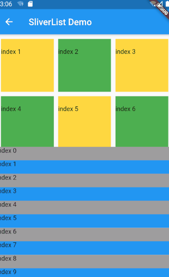
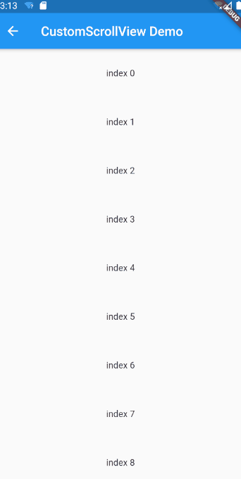

# CustomScrollView --- 可包含多种滚动模型。

> flutter widget demo 地址：[github](https://github.com/Rudy24/flutter_study/tree/master/flutter_study_demo1/lib)

一般滚动我们可以用`ListView`或者`GridView`,它们滚动效果都是独立的，如果把它们放在一起会产生两个不同的滚动效果，像分离了一样，如果需要多个滚动而且又像个整体一样，这时就需要用到`CustomScrollView`了。不能将`ListView`或者`GridView`作为`CustomScrollView`的子元素使用，而需要使用 Flutter 提供可滚动的 Sliver 版，例如`SliverList`,`SliverGrid`等等。

ListView + GridView

CustomScrollView

#### 引文

> 1. [CustomScrollView](https://book.flutterchina.club/chapter6/custom_scrollview.html)
