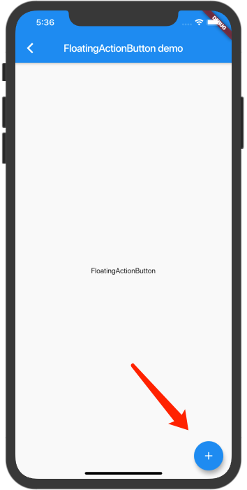
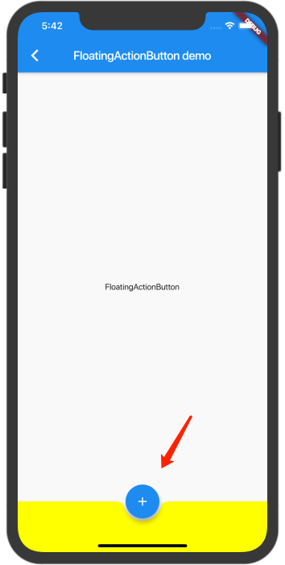

# 每周学习一个 Flutter widget 7: FloatingActionButton --- widget 浮动按钮

> flutter widget demo 地址：[github](https://github.com/Rudy24/flutter_study/blob/master/flutter_study_demo1/lib/floatingActionButton/floatingActionButton.md)

`FloatingActionButton`是 `Flutter`提供的一个浮动按钮，会布局在右边下方，如果配合`bottomNavigationBar`使用，它可以实现一个比较酷的布局，现在看看吧。

这是单独使用的效果





这是配合`bottomNavigationBar`使用的效果，是不是跟咸鱼app主页的发布功能很像呢？



源码如下：
```dart
class FloatingActionButtonDemo extends StatelessWidget {
  @override
  Widget build(BuildContext context) {
    return Scaffold(
      appBar: AppBar(
        title: const Text('FloatingActionButton demo'),
      ),
      body: Center(
        child: Text('FloatingActionButton'),
      ),
      floatingActionButton: FloatingActionButton(
        child: Icon(Icons.add),
        onPressed: () {},
      ),
      bottomNavigationBar: BottomAppBar(
        shape: const CircularNotchedRectangle(), // 不能丢了这个，否则按钮下面凹下去的效果就没了。
        color: Colors.yellowAccent,
        child: Container(
          height: 50.0,
        ),
      ),
      floatingActionButtonLocation: FloatingActionButtonLocation.centerDocked,
    );
  }
}

```
