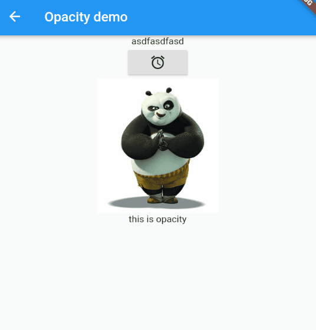

# 每周学习一个 Flutter widget 5: Opacity --- widget 透明度

> flutter widget demo 地址：[github](https://github.com/Rudy24/flutter_study/blob/master/flutter_study_demo1/lib/opacity/opacity.md)

如果你想一个`widget`在屏幕中不可见，且原来的布局保持不变，这个时候你可以试一试`Opacity`，你只需设置透明度的值，
就像前端 css 设置 opacity 值。



这样切换过程很生硬，如果加点动画就好了，但是直接在`Opacity`设置动画是不太明智的选择，这样的效率很低，动画的每一帧效果都会导致 `Opacity` 的子控件树重建,
建议使用`AnimatedOpacity`代替。

```javascript

class OpacityDemoState extends State<OpacityDemo> {
  bool _visible = false;
  @override
  Widget build(BuildContext context) {
    return Scaffold(
      appBar: AppBar(
        title: const Text('Opacity demo'),
      ),
      body: Center(
        child: Column(
          children: <Widget>[
            const Text('asdfasdfasd'),
            RaisedButton(
              onPressed: () {
                setState(() {
                  _visible = !_visible;
                });
              },
              child: Icon(Icons.access_alarms),
            ),
            Container(
              child: Opacity(
                opacity: _visible ? 1.0 : 0.2,
                child: Image.network(
                  'https://timgsa.baidu.com/timg?image&quality=80&size=b9999_10000&sec=1578842509583&di=25c774f1659acc32c297455124dd3f14&imgtype=0&src=http%3A%2F%2Fi1.sinaimg.cn%2Fent%2Fd%2F2008-06-04%2FU105P28T3D2048907F326DT20080604225106.jpg',
                  width: 200,
                  height: 200,
                ),
              ),
            ),
            const Text('this is opacity')
          ],
        ),
      ),
    );
  }
}


```
