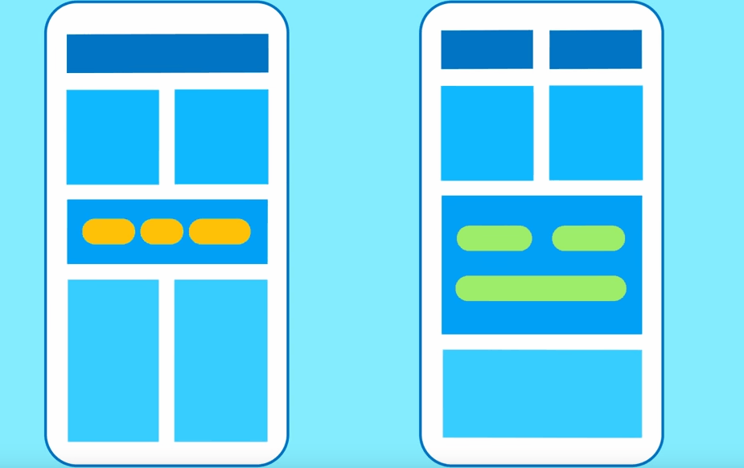

# PageView --- 屏幕滚动（flutter 版 swiper）

在`flutter`项目中，如果想屏幕左右，上下滑动（类似于抖音效果），它提供了一个非常简单的`widget`--- `PageView`.

```javascript

import 'package:flutter/cupertino.dart';
import 'package:flutter/material.dart';

class PageViewDemo extends StatefulWidget {
  @override
  PageViewDemoState createState() => PageViewDemoState();
}

class PageViewDemoState extends State<PageViewDemo> {
  PageController _controller;

  PageView _pageViews;
  @override
  void initState() {
    _controller = PageController(initialPage: 0);

    _pageViews = PageView(
      controller: _controller,
      scrollDirection: Axis.vertical,
      children: <Widget>[
        Container(
          alignment: Alignment.center,
          color: Colors.red,
          child: Text('Colors.red'),
        ),
        Container(
          alignment: Alignment.center,
          color: Colors.blue,
          child: Text('Colors.blue'),
        ),
        Container(
          alignment: Alignment.center,
          color: Colors.greenAccent,
          child: Text('Colors.greenAccent'),
        )
      ],
    );
    super.initState();
  }

  @override
  Widget build(BuildContext context) {
    return Scaffold(
      appBar: AppBar(
        title: const Text('PageView demo'),
      ),
      body: Center(
        child: _pageViews,
      ),
    );
  }
}

```



`PageController`配置初始值等，`PageView`设置滚动的页面，滚动的方向等。
