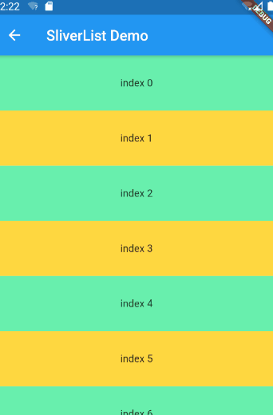
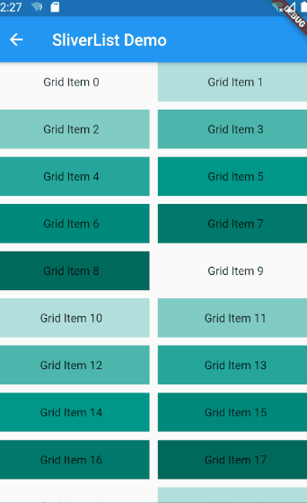
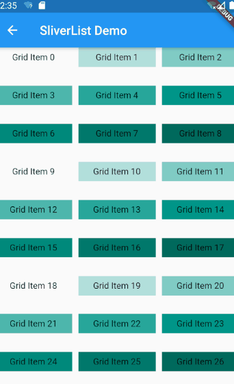
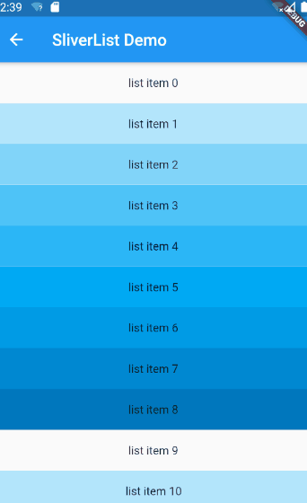

# SliverList，SliverGrid，SliverFixedExtentList --- CustomScrollView 下的滚动利器

> flutter widget demo 地址：[github](https://github.com/Rudy24/flutter_study/tree/master/flutter_study_demo1/lib)

## SliverList 滚动 list，

只有个`delegate`属性，用来构建 list 列表,可以自定义高度。

```javascript

 SliverList(
    delegate:
        SliverChildBuilderDelegate((BuildContext context, int index) {
      return Container(
        alignment: Alignment.center,
        color:
            index % 2 == 1 ? Colors.amberAccent : Colors.greenAccent,
        child: Padding(
          padding: EdgeInsets.symmetric(vertical: 30.0),
          child: Text('index $index'),
        ),
      );
    }, childCount: 20),
  )

```



## SliverGrid 可滚动的网格布局。

有两个参数，`delegate`, `gridDelegate`， `delegate`上面已经说过了。来说说`gridDelegate`属性吧。
`gridDelegate`是`SliverChildDelegate`类型，`SliverChildDelegate`是个抽象类,
`SliverGridDelegateWithMaxCrossAxisExtent`,`SliverGridDelegateWithFixedCrossAxisCount`继承`SliverChildDelegate`来实现布局

SliverGridDelegateWithMaxCrossAxisExtent:

> 1.  maxCrossAxisExtent //@required 最大宽度
> 2.  mainAxisSpacing // 上下间距
> 3.  crossAxisSpacing // 左右间距
> 4.  childAspectRatio // 横纵比

```javascript

SliverGrid(
    gridDelegate: SliverGridDelegateWithMaxCrossAxisExtent(
      maxCrossAxisExtent: 200.0,
      mainAxisSpacing: 10.0,
      crossAxisSpacing: 10.0,
      childAspectRatio: 4.0,
    ),
    delegate: SliverChildBuilderDelegate(
      (BuildContext context, int index) {
        return Container(
          alignment: Alignment.center,
          color: Colors.teal[100 * (index % 9)],
          child: Text('Grid Item $index'),
        );
      },
      childCount: 30,
    ),
  )

```



SliverGridDelegateWithFixedCrossAxisCount:

> 1.  crossAxisCount //@required 左右排列个数
> 2.  mainAxisSpacing // 上下间距
> 3.  crossAxisSpacing // 左右间距
> 4.  childAspectRatio // 横纵比

```javascript

SliverGrid(
    gridDelegate: SliverGridDelegateWithFixedCrossAxisCount(
      crossAxisCount: 3,
      mainAxisSpacing: 30.0,
      crossAxisSpacing: 10.0,
      childAspectRatio: 4.0,
    ),
    delegate: SliverChildBuilderDelegate(
      (BuildContext context, int index) {
        return Container(
          alignment: Alignment.center,
          color: Colors.teal[100 * (index % 9)],
          child: Text('Grid Item $index'),
        );
      },
      childCount: 50,
    ),
  ),

```



## SliverFixedExtentList 固定高度可滚动 list。

如果 item 高度固定，优先使用这个，效率相比`SliverList`会高。它有两个属性，`itemExtent`,`delegate`。

`itemExtent`： `double`，每个 item 的高度

```javascript

SliverFixedExtentList(
    itemExtent: 50.0,
    delegate:
        SliverChildBuilderDelegate((BuildContext context, int index) {
      return Container(
        alignment: Alignment.center,
        color: Colors.lightBlue[100 * (index % 9)],
        child: Text('list item $index'),
      );
    }, childCount: 30),
  )

```



#### 引文

> 1.  [SliverList class](https://api.flutter.dev/flutter/widgets/SliverList-class.html)
