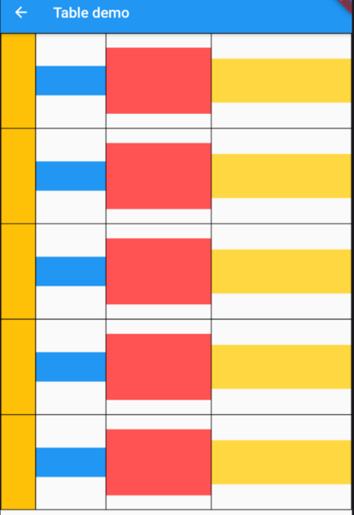

# Table --- 表格组件

在`Flutter`里`GridView`可以轻松制作可滚动得小部件网格，见[GridView 布局](https://github.com/Rudy24/flutter_study/blob/master/flutter_study_demo1/lib/gridView/gridView.md),如果你不想创建可滚动网格呢？这个时候就需要用到`Table`了。

表格非常适合创建您不想滑动的小部件网格，尤其是如果您拥有不同大小的小部件。嵌套的行和列可能会有点乱，但表格小部件提供了一致性并为您调整子窗口小部件的大小。试一试吧！

```javascript
import 'package:flutter/cupertino.dart';
import 'package:flutter/material.dart';

class TableDemo extends StatelessWidget {
  final List<int> _list = [
    1,
    2,
    3,
    4,
    5,
  ];
  @override
  Widget build(BuildContext context) {
    return Scaffold(
      appBar: AppBar(
        title: const Text('Table demo'),
      ),
      body: Table(
        defaultVerticalAlignment: TableCellVerticalAlignment.middle, // 对其方式
        // defaultColumnWidth: FixedColumnWidth(30.0),
        defaultColumnWidth: IntrinsicColumnWidth(), // 设置默认column宽度
        columnWidths: {
          0: FractionColumnWidth(0.1),
          1: FractionColumnWidth(0.2),
          2: FractionColumnWidth(0.3),
          3: FractionColumnWidth(0.4),
        }, // 可以控制具体列得占比
        border: TableBorder.all(),
        children: _list
            .map(
              (n) => TableRow(children: [
                Container(
                  color: Colors.amber,
                  width: 30,
                  height: 130,
                ),
                Container(
                  color: Colors.blue,
                  width: 60,
                  height: 40,
                ),
                Container(
                  color: Colors.redAccent,
                  width: 60,
                  height: 90,
                ),
                Container(
                  color: Colors.amberAccent,
                  width: 60,
                  height: 60,
                ),
              ]),
            )
            .toList(),
      ),
    );
  }
}


```



```javascript

 Table({
    Key key,
    this.children = const <TableRow>[],
    this.columnWidths,
    this.defaultColumnWidth = const FlexColumnWidth(1.0),
    this.textDirection,
    this.border,
    this.defaultVerticalAlignment = TableCellVerticalAlignment.top,
    this.textBaseline,
  })

```

`Table`有些属性，我们来看下，

1. `columnWidths` 可以设置每水平列宽度占比，
2. `defaultVerticalAlignment` 可以设置垂直对其方式
