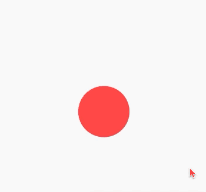

# 每周学习一个 Flutter widget 4: AnimatedContainer --- Container 的动画渐变效果

> flutter widget demo 地址：[github](https://github.com/Rudy24/flutter_study/blob/master/flutter_study_demo1/lib/animatedContainer/animatedContainer.md)

有这么个需求，点击按钮后，切换某块区域的样式，然后三下五除二就把这个功能就实现了


呃呃呃呃呃，好生硬啊，咱们是前端，不仅需要实现功能，而且也要带给用户更好的体验。如果能转换过程中带点动画，是不是会更好点呢？

`AnimatedContainer` 类提供了一系列实用方法，能够便捷地创建出一个具有指定宽度、高度、背景颜色、外边距和边框等属性的 widget。
简单的动画通常会在一段时间内改变这些属性。例如你可能想将灰色背景逐渐变为绿色背景来告诉用户已经选择了某个项目。

直接上代码看效果

```javascript


import 'package:flutter/cupertino.dart';
import 'package:flutter/material.dart';

class AnimatedContainerDemo extends StatefulWidget {
  @override
  AnimatedContainerDemoState createState() => AnimatedContainerDemoState();
}

class AnimatedContainerDemoState extends State<AnimatedContainerDemo> {
  bool selected = false;
  @override
  Widget build(BuildContext context) {
    return Scaffold(
      appBar: AppBar(
        title: const Text('AnimatedContainer demo'),
      ),
      body: InkWell(
        onTap: () {
          setState(() {
            selected = !selected;
          });
        },
        child: Center(
          child: AnimatedContainer(
            width: selected ? 100.0 : 150.0,
            height: selected ? 100.0 : 200.0,
            decoration: BoxDecoration(
                color: selected ? Colors.red : Colors.blue,
                borderRadius: selected
                    ? BorderRadius.circular(100)
                    : BorderRadius.circular(0)),
            alignment:
                selected ? Alignment.center : AlignmentDirectional.topCenter,
            duration: Duration(seconds: 2),
            curve: Curves.fastOutSlowIn,
            child: FlutterLogo(
              size: 75,
            ),
          ),
        ),
      ),
    );
  }
}

```


在你的项目中使用这样得效果是不是很赞呢？
