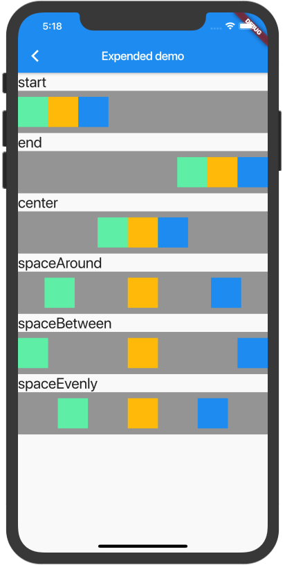
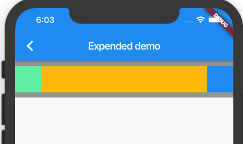

## 每周学习一个 Flutter widget 2 : Expanded --- 填补可用的空间

> flutter widget demo 地址：[github](https://github.com/Rudy24/flutter_study/blob/master/flutter_study_demo1/lib/expanded/expanded.md)

几乎每个`Flutter`布局都需要用到`Row`行和`Column`列, `Row`或`Column`类似于 前端 css 中的 `flex`布局，



`Row`或`Column`可以生成上面任何一个布局，也覆盖了业务的大部分布局，但总是有例外的嘛～～～，例如下面这种



看到这种布局，前端同学应该印象，利用`flex`布局，左右两边固定，中间自适应就可以实现这样的布局。那`Flutter`如何实现这种布局呢？其实`Flutter`更简单，只需要用`Expanded`包裹中间，然后设置 flex 属性即可。

```javascript

Row _buildRowExpanded() {
    return Row(
      children: <Widget>[
        Container(
          color: Colors.greenAccent,
          height: 50,
          width: 50,
        ),
        Expanded(
          flex: 1,
          child: Container(
            color: Colors.amber,
            width: 50,
            height: 50,
          ),
        ),
        Container(
          color: Colors.blue,
          height: 50,
          width: 50,
        )
      ],
    );
  }

```
