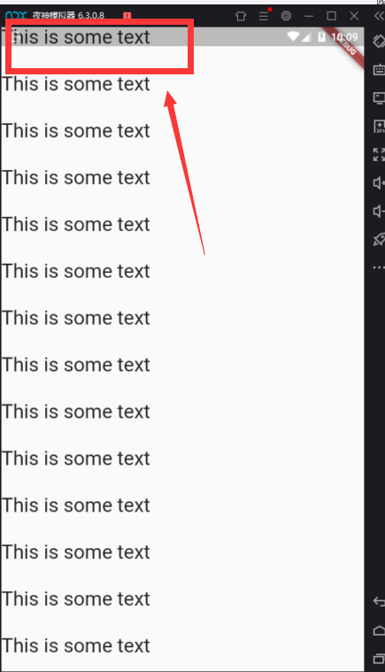
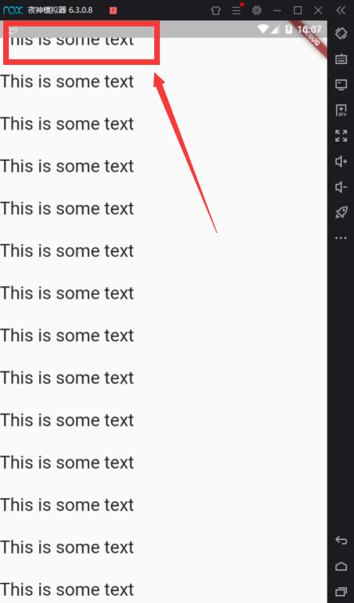

[toc]

## 每周学习一个 Flutter widget 1 ： SafeArea -- 设置屏幕安全区域

> flutter widget demo 地址：[github](https://github.com/Rudy24/flutter_study/blob/master/flutter_study_demo1/lib/safearea/safearea.md)

现在的智能机已经不再是普通的矩形屏幕了，而是一些圆角或是带凹槽的屏幕了，那如何正确适配就成了关键。`flutter`为此提供了
一个专属`widget SafeArea`;

`Flutter` 的 `SafeArea` 工具可以避免讨厌的消息通知栏和不规则的手机屏幕干扰您的应用程序的正常显示。

让我们来看看界面有无`SafeArea` 的区别。

```javascript
import 'package:flutter/cupertino.dart';
import 'package:flutter/material.dart';

class SafeAreaDemo extends StatelessWidget {
  @override
  Widget build(BuildContext context) {
    return Scaffold(
      body: ListView(
          children: List.generate(
              100,
              (i) => Container(
                    color: i % 2 == 1 ? Colors.red : Colors.greenAccent,
                    padding: EdgeInsets.symmetric(vertical: 16.0),
                    child: const Text(
                      'This is some text',
                      style: TextStyle(fontSize: 26.0),
                    ),
                  )),
        ),
    );
  }
}


```



```javascript
import 'package:flutter/cupertino.dart';
import 'package:flutter/material.dart';

class SafeAreaDemo extends StatelessWidget {
  @override
  Widget build(BuildContext context) {
    return Scaffold(
      body: SafeArea(
        child: ListView(
          children: List.generate(
              100,
              (i) => Container(
                    color: i % 2 == 1 ? Colors.red : Colors.greenAccent,
                    padding: EdgeInsets.symmetric(vertical: 16.0),
                    child: const Text(
                      'This is some text',
                      style: TextStyle(fontSize: 26.0),
                    ),
                  )),
        ),
      ),
    );
  }
}


```



第一张图是没有设置`SafeArea`,下面一张是设置了。

不仅这样，`SafeArea`还可以设置不同的方向，默认四边都是`true`，你可以根据需要设置单边，只要改动属性即可。

```javascript

  const SafeArea({
    Key key,
    this.left = true,
    this.top = true,
    this.right = true,
    this.bottom = true,
  })

```


