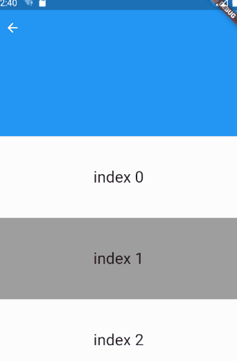
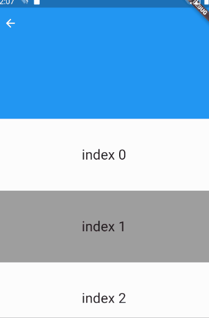
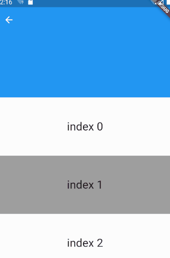
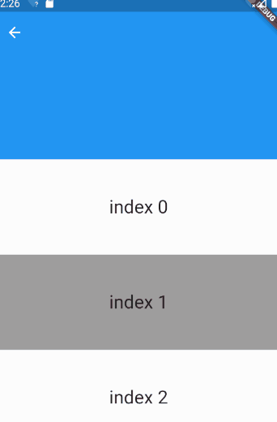

# SliverAppBar --- app 导航栏滚动效果

> flutter widget demo 地址：[github](https://github.com/Rudy24/flutter_study/tree/master/flutter_study_demo1/lib)

当滚动页面时，可以设置导航栏发生显示或消失的动画，可以使用`SliverAppBar`，需要与`CustomScrollView`配合使用。

`SliverAppBar` 的属性大部分与`AppBar`相同，介绍下主要不同的属性，

- expandedHeight // double 类型，可滚动视图的高度，也就是伸缩区域
- floating // bool 向上滚动，伸缩区域被覆盖之后，开始向下滚动时展现方式
- pinned // bool 是否滚顶在导航栏
- snap // bool 配合 floating 使用

1. `floating: false`, `pinned: false`, `snap: false`



2. `floating: false`, `pinned: true`, `snap: false`



3. `floating: true`, `pinned: true`, `snap: false`



4. `floating: true`, `pinned: true`, `snap: true`
   之前一直觉得`snap`属性没啥用，刚仔细看了下，展现效果还是有点不一样，
   对比第三，第四图，会发现，`snap`为`false`时，向下滚动，页面滚动一些，伸缩区域就出来一点，知道页面滚动超过区域高度，伸缩区域才会完全展示出来，
   但如果`snap`设置为`true`时，只要页面向下滚动，伸缩区域就会完全展示出来。



```javascript

import 'package:flutter/cupertino.dart';
import 'package:flutter/material.dart';

class SliverAppBarDemo extends StatelessWidget {
  @override
  Widget build(BuildContext context) {
    return Scaffold(
      body: CustomScrollView(
        slivers: <Widget>[
          SliverAppBar(
            pinned: true, // 滚动到顶部是否要固定在导航栏
            floating: true,
            snap: true, // 与floating结合用
            expandedHeight: 200.0,
          ),
          SliverList(
            delegate:
                SliverChildBuilderDelegate((BuildContext context, int index) {
              return Container(
                alignment: Alignment.center,
                padding: EdgeInsets.symmetric(vertical: 50),
                color: index % 2 == 0 ? Colors.white38 : Colors.grey,
                child: Text(
                  'index $index',
                  style: TextStyle(fontSize: 25),
                ),
              );
            }, childCount: 20),
          )
        ],
      ),
    );
  }
}


```
