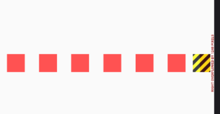
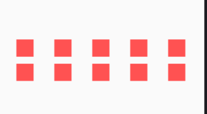

# 每周学习一个 Flutter widget 3: Wrap --- 自动换行神器

> flutter widget demo 地址：[github](https://github.com/Rudy24/flutter_study/blob/master/flutter_study_demo1/lib/wrap/wrap.md)

当你在使用`Row` 或 `Column` 布局时，一屏空间用完时，会出现如下情况，这是因为你超出屏幕最大宽度，而`Row` 或 `Column`不会自动换行。
这个时候你在想，要是他们可以自动换行就好了，可事实往往不能如你所愿，虽然`Row`,`Column`不能字段换行，但条条大路通罗马，这时你需要用到`Wrap`。
它会帮你解决这一难题。

```javascript

import 'package:flutter/cupertino.dart';
import 'package:flutter/material.dart';

class WrapDemo extends StatelessWidget {
  final List<int> _list = [1, 2, 3, 4, 5, 6, 7, 8, 9, 10];
  @override
  Widget build(BuildContext context) {
    return Scaffold(
      appBar: AppBar(
        title: const Text('Wrap demo'),
      ),
      body: Center(
        child: Row(
          children: _list.map((item) {
            return Padding(
              padding: EdgeInsets.symmetric(horizontal: 16.0),
              child:
                  Container(width: 40.0, height: 40.0, color: Colors.redAccent),
            );
          }).toList(),
        ),
      ),
    );
  }
}

```



再来看看用了`Wrap`之后。

```javascript

import 'package:flutter/cupertino.dart';
import 'package:flutter/material.dart';

class WrapDemo extends StatelessWidget {
  final List<int> _list = [1, 2, 3, 4, 5, 6, 7, 8, 9, 10];
  @override
  Widget build(BuildContext context) {
    return Scaffold(
      appBar: AppBar(
        title: const Text('Wrap demo'),
      ),
      body: Center(
        child: Wrap(
          runSpacing: 16.0,
          spacing: 16.0,
          children: _list.map((item) {
            return Padding(
              padding: EdgeInsets.symmetric(horizontal: 16.0),
              child:
                  Container(width: 40.0, height: 40.0, color: Colors.redAccent),
            );
          }).toList(),
        ),
      ),
    );
  }
}


```



`Wrap`已经实现了自动换行，不会再发生溢出的问题了。另外`Wrap`还有些属性，比如方向`direction`,左右边距`spacing`,上下边距`runSpacing`等属性，让我们可以得到更好布局效果。

```javascript

  Wrap({
    Key key,
    this.direction = Axis.horizontal,
    this.alignment = WrapAlignment.start,
    this.spacing = 0.0,
    this.runAlignment = WrapAlignment.start,
    this.runSpacing = 0.0,
    this.crossAxisAlignment = WrapCrossAlignment.start,
    this.textDirection,
    this.verticalDirection = VerticalDirection.down,
    List<Widget> children = const <Widget>[],
  }) : super(key: key, children: children);

```
