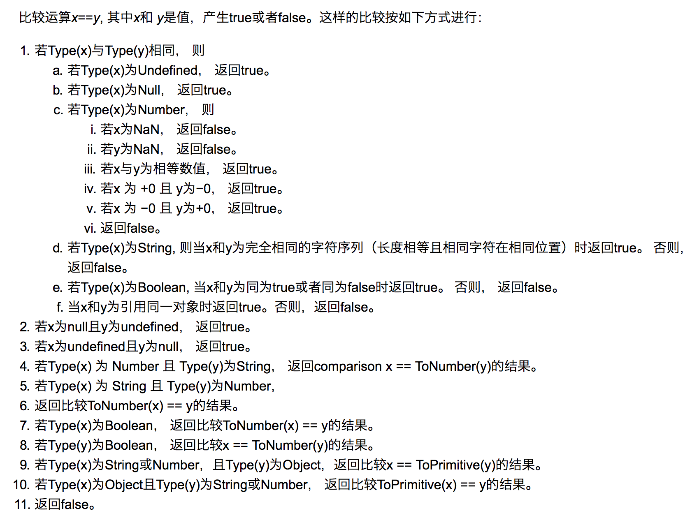

### 重点

1. Vue 原理分析
2. Vue-router 基本原理分析
3. Vuex 基本原理分析

#### 面试范围

已分优先级

1. JavaScript 闭包，防抖，节流
2. Css
3. 框架,例如 Vue
4. 性能
5. HTTP
6. webpack
7. 适配
8. 浏览器
9. 缓存
10. 小程序
11. 安全
12. Flutter
13. Node
14. nginx
15. html
16. 项目情况
17. 遇到的难点及认为做的好的地方
18. TypeScript

闭包：
闭包的用途
  - 可以读取函数内部的变量
  - 让这些变量的值始终保持在内存中，不会在function调用后被自动清除。
闭包的优点
  - 延长了变量的生命周期
  - 可以访问函数内部的私有变量

闭包的缺点
  - 因为一段内存空间内的函数空间不会被销毁，常驻内存会增大内存使用量
  - 在使用不当的情况下，容易发生内存泄漏 （只存在于IE）
##### 1. 对象转基本类型

对象在转换基本类型时，首先会调用 valueOf 然后调用 toString。并且这两个方法你是可以重写的。

```javascript
let a = {
  valueOf() {
    return 0;
  },
};
```

当然你也可以重写 Symbol.toPrimitive ，该方法在转基本类型时调用优先级最高。

```javascript
let a = {
  valueOf() {
    return 0;
  },
  toString() {
    return "1";
  },
  [Symbol.toPrimitive]() {
    return 2;
  },
};
1 + a; // => 3
"1" + a; // => '12'
```

##### 2. 四则运算符

只有当加法运算时，其中一方是字符串类型，就会把另一个也转为字符串类型。
其他运算只要其中一方是数字，那么另一方就转为数字。并且加法运算会触发三种类型转换：
将值转换为原始值，转换为数字，转换为字符串。

```javascript
1 + "1"; // '11'
2 * "2"[(1, 2)] + // 4
  [2, 1]; // '1,22,1'
// [1, 2].toString() -> '1,2'
// [2, 1].toString() -> '2,1'
// '1,2' + '2,1' = '1,22,1'
```

对于加号需要注意这个表达式 `'a' + + 'b'`

```javascript
"a" + +"b"; // -> "aNaN"
// 因为 + 'b' -> NaN
// 你也许在一些代码中看到过 + '1' -> 1
```

##### 3. `==`操作符



上图中的 `toPrimitive` 就是对象转基本类型。

这里来解析一道题目 `[] == ![] // -> true` ，下面是这个表达式为何为 true 的步骤

```javascript

// [] 转成 true，然后取反变成 false
[] == false
// 根据第 8 条得出
[] == ToNumber(false)
[] == 0
// 根据第 10 条得出
ToPrimitive([]) == 0
// [].toString() -> ''
'' == 0
// 根据第 6 条得出
0 == 0 // -> true

```

```javascript

string，number ==> number
boolean, 其他 ==> ToNumber(boolean)
Object，{string，number} ==> ToPrimitive(Object) == string|number

```


#### 4. 模块化

- CommonJS：是 Node 独有的规范，浏览器中使用需要用到`Browserify`解析了。
  对于`CommonJS`和 ES6 中的模块化的区别是：

  - 前者支持动态导入，也就是`require(${path}/xx.js)`,后者目前不支持，但是已有提案。
  - 前者是同步导入，因为用于服务器，文件都存在本地，同步导入即使卡住主线程影响也不大。而后者是异步导入，因为用于浏览器，需要下载文件，如果也采用同步导入会对渲染有很大的影响。
  - 前者在导出时都是值拷贝，就算到处的值变了，导入的值也不会改变，所以如果想更新值，必须重新导入一次。但是后者采用的实时绑定的方式，导入导出的值都指向同一个内存地址，所以导入值会随着导出值变化。
  - 后者会编译成 `require/exports` 来执行的。

- AMD

  - AMD 是由 `RequireJS`提出的

  ```javascript
  // AMD
  define(["./a", "./b"], function (a, b) {
    // 加载模块化完毕后，可以使用
    a.do();
    b.do();
  });

  // CMD
  define(function (require, exports, module) {
    // 加载模块
    // 可以把 require 写在函数体的任意地方实现延迟加载
    var a = require("./a");
    a.do();
  });
  ```

#### 5. 防抖

> 防抖和节流的作用都是防止函数多次调用。区别在于，假设一个用户一直触发这个函数，且每次触发函数的间隔小于 wait，防抖的情况下只会调用一次，而节流的情况会每隔一定时间(参数 wait)调用函数。

每次触发函数的间隔小于 wait

- 防抖：只会调用一次 (防抖的原理就是：你尽管触发事件，但是我一定在事件触发 n 秒后才执行，如果你在一个事件触发的 n 秒内又触发了这个事件，那我就以新的事件的时间为准，n 秒后才执行，总之，就是要等你触发完事件 n 秒内不再触发事件，我才执行，真是任性呐!)
- 节流：每隔一定时间(参数 wait)调用函数

**防抖**

```javascript
// 第一版，简单实现防抖功能
function debounce(func, wait) {
  let timeout;
  return function () {
    if (timeout) clearTimeout(timeout);
    timeout = setTimeout(func, wait);
  };
}

// 第二版，在使用回调函数时，this就会指向window对象，所以需要更正this指向正确的对象
function debounce(func, wait) {
  let timeout;
  return function () {
    const ctx = this;
    if (timeout) clearTimeout(timeout);
    timeout = setTimeout(function () {
      func.apply(ctx);
    }, wait);
  };
}

// 接收参数
function debounce(func, wait) {
  let timeout;

  return function () {
    const ctx = this;
    const args = arguments;
    if (timeout) clearTimeout(timeout);

    timeout = setTimeout(function () {
      func.apply(ctx, args);
    }, wait);
  };
}

// 立即执行函数，待 wait后 才可以再执行
function debounce(func, wait, immediate) {
  let timeout;
  return function () {
    const ctx = this;
    const args = arguments;

    if (timeout) clearTimeout(timeout);
    if (immediate) {
      // 如果已经执行过，不再执行，待wait后才可以执行
      const callNow = !timeout;
      timeout = setTimeout(function () {
        timeout = null;
      }, wait);
      if (callNow) func.apply(ctx, args);
    } else {
      timeout = setTimeout(function () {
        func.apply(ctx, args);
      }, wait);
    }
  };
}

// 新增返回值
function debounce(func, wait, immediate) {
  let timeout, result;

  return function () {
    const ctx = this;
    const args = arguments;

    if (timeout) clearTimeout(timeout);
    if (immediate) {
      // 如果已经执行过，不再执行
      const callNow = !timeout;
      timeout = setTimeout(function () {
        timeout = null;
      }, wait);
      if (callNow) result = func.apply(ctx, args);
    } else {
      timeout = setTimeout(function () {
        func.apply(ctx, args);
      }, wait);
    }

    return result;
  };
}
```

**节流**
防抖动和节流本质是不一样的。防抖动是将多次执行变为最后一次执行，节流是将多次执行变成每隔一段时间执行。

实现节流的主流方式有两种：一种是使用时间戳，另外一种是设置定时器

1. 使用时间戳
   当触发事件的时候，我们取出当前的时间戳，然后减去之前的时间戳(最一开始值设为 0)，如果大于设置的事件周期，就执行函数，然后更新时间戳为当前的时间戳，如果小于就不执行

```javascript
// 第一版
function throttle(func, wait) {
  let ctx, args;
  let privious = 0;

  return function () {
    let now = +new.Date();
    ctx = this;
    args = arguments;
    if (now - privious > wait) {
      func.apply(ctx, args);
      privious = now;
    }
  };
}
```

2. 使用定时器
   当触发事件的时候，我们设置一个定时器，再触发事件的时候，如果定时器存在，就不执行，知道定时器执行，然后执行函数，清空定时器。

```javascript
function throttle(func, wait) {
  let timeout;
  let previous = null;
  let ctx, args;

  return function () {
    ctx = this;
    args = arguments;

    if (!timeout) {
      timeout = setTimeout(function () {
        timeout = null;
        func.apply(ctx, args);
      }, wait);
    }
  };
}

// 第三版
function throttle(func, wait) {
  let timeout, ctx, args;
  let previous = 0;

  const later = function () {
    previous = +new Date();
    timeout = null;
    func.apply(ctx, args);
  };

  return function () {
    ctx = this;
    args = arguments;
    const now = +new Date();
    // 下次触发 func 剩余的时间
    const remaining = wait - (now - previous);
    // 如果没有剩余的时间或者你改了系统的时间
    if (remaining <= 0 || remaining > wait) {
      if (timeout) {
        clearTimeout(timeout);
        timeout = null;
      }
      previous = now;
      func.apply(ctx, args);
    } else if (!timeout) {
      timeout = func.apply(later, remaining);
    }
  };
}

那我们设置个 options 作为第三个参数，然后根据传的值判断到底哪种效果，我们约定:

leading：false 表示禁用第一次执行
trailing: false 表示禁用停止触发的回调

/**
 * underscore 节流函数，返回函数连续调用时，func 执行频率限定为 次 / wait
 *
 * @param  {function}   func      回调函数
 * @param  {number}     wait      表示时间窗口的间隔
 * @param  {object}     options   如果想忽略开始函数的的调用，传入{leading: false}。
 *                                如果想忽略结尾函数的调用，传入{trailing: false}
 *                                两者不能共存，否则函数不能执行
 * @return {function}             返回客户调用函数
 */

// 第四版
function throttle(func, wait, options = {}) {
  let timeout, ctx, args;
  let previous = 0;

  const later = function () {
    previous = options.leading === false ? 0 : +new Date();
    timeout = null;
    func.apply(ctx, args);
    if (!timeout) ctx = args = null;
  };

  return function () {
    const now = +new Date();
    ctx = this;
    args = arguments;
    if (!previous && options.leading === false) previous = now;
    let remaining = wait - (now - previous);

    if (remaining <= 0 || remaining > wait) {
      if (timeout) {
        clearTimeout(timeout);
        timeout = null;
      }
      previous = now;
      func.apply(ctx, args);
      if (!timeout) ctx = args = null;
    } else if (!timeout && options.trailing !== false) {
      timeout = setTimeout(later, remaining);
    }
  };
}
```

#### 6. call,apply,bind 的区别？

首先说下前二者的区别。
`call` 和 `apply`都是为了解决改变`this`的指向，作用都是相同的，只是传参方式不同。

- `call` 可以接收一个参数列表
- `apply` 可以接收一个参数数组

```javascript
let a = {
  value: 1,
};

function getValue(name, age) {
  console.log(name, age, this.value);
}

getValue.call(a, "rudy", "24");
getValue.call(a, ["rudy", "24"]);
```

模拟实现`call` 和 `apply`
可以从以下几点来考虑如何实现

- 不传入第一个参数，那么默认为`window`
- 改变`this`指向，让新的对象可以执行函数。那么思路是否可以变成给新的对象添加一个函数，然后再执行完后删掉？

```javascript
Function.prototype.myCall = function (context) {
  var context = context || window;
  // 给 context 添加一个属性
  // getValue.call(a, 'rudy', '24') => a.fn = getValue
  context.fn = this;
  // 将 context 后面的参数取出来
  var args = [...arguments].slice(1);
  // getValue.call(a, 'rudy', '24') => a.fn('yck', '24')
  var result = context.fn(...args);
  // 删除 fn
  delete context.fn;
  return result;
};
```

`apply` 的实现也很类型

```javascript
Function.prototype.myApply = function (context) {
  var context = context || window;
  context.fn = this;

  var result;
  if (arguments[1]) {
    result = context.fn(...arguments[1]);
  } else {
    result = context.fn();
  }

  delete context.fn;

  return result;
};
```

bind 和其他两个方法作用也是一致的，只是该方法会返回一个函数。并且我们可以通过 bind 实现柯里化。

同样的，也来模拟实现下 bind

```javascript
Function.prototype.myBind = function (ctx) {
  if (typeof this !== "function") throw new TypeError("Error");

  let _this = this;
  let args = [...arguments].slice(1);

  return function F() {
    // 这里需要加这个判断是因为,bind会返回一个函数,这个函数可以作为构造函数
    if (this instanceof F) {
      return new _this(...args, ...arguments);
    }
    // 这里参数需要拼接当前参数和绑定时传的参数
    return _this.apply(ctx, args.concat(...arguments));
  };
};
```

#### 7. 0.1 + 0.2 === 0.3 ? 解决方案？

0.1 转成 2 进制是个二进制无限循环小数，但是计算机内存有限，不能存储所有小数位数，只能有所取舍，所以就在某个精度点去舍，
当然，代价就是，0.1 在计算机内部根本就不是精确的 0.1，而是一个有舍入误差的 0.1。当代码被编译或解释后，0.1 已经被四舍五入成一个与之很接近的计算机内部数字，以至于计算还没开始，一个很小的舍入错误就已经产生了。这也就是 0.1 + 0.2 不等于 0.3 的原因

1. 为什么 0.1 + 0.2 不等于 0.3。因为计算机不能精确表示 0.1， 0.2 这样的浮点数，计算时使用的是带有舍入误差的数
2. 并不是所有的浮点数在计算机内部都存在舍入误差，比如 0.5 就没有舍入误差
3. 具有舍入误差的运算结可能会符合我们的期望，原因可能是“负负得正”
4. 怎么办？1 个办法是使用整型代替浮点数计算；2 是不要直接比较两个浮点数，而应该使用 bignumber.js 这样的浮点数运算库

`parseFloat((0.1 + 0.2).toFixed(10)) `

#### 正则表达式

1. var s1 = "get-element-by-id"; 给定这样一个连字符串，写一个 function 转换为驼峰命名法形式的字符串 getElementById

```javascript
const format = (s1) => s1.replace(/-\w/g, (s) => s.slice(1).toUpperCase());
```

2. 判断字符串是否包含数字

```javascript
const s2 = "aabbccdd11dd";

const f2 = (s) => {
  const reg = /\d/g;
  return reg.test(s);
};
```

3. 判断电话号码

```javascript
const s3 = "13715041614";

const f3 = (s) => {
  const reg = /^1[3-9]\d{9}$/g;
  return reg.test(s);
};
```

4. 判断是否符合指定格式

给定字符串 str，检查其是否符合如下格式

XXX-XXX-XXXX
其中 X 为 Number 类型

```javascript
const s4 = "123-456-7890";
const f4 = (s) => {
  const reg = /^(\d{3}\-){2}\d{4}$/g;
  return reg.test(s);
};
```

5. 判断是否符合 USD 格式

给定字符串 str，检查其是否符合美元书写格式

1. 以 $ 开始
2. 整数部分，从个位起，满 3 个数字用 , 分隔
3. 如果为小数，则小数部分长度为 1-2
4. 正确的格式如：$1,023,032.03 或者 $2.03，错误的格式如：$3,432,12.12 或者 $34,344.3\*\*

```javascript
const s5 = "$12,345.67";
const f5 = (s) => {
  const reg = /^\$\d{1,3}(,\d{3})*(\.\d{1,2})?$/;
  return reg.test(s);
};
```

如何格式化 USD？
现提供 3 中解决方案，1. 正则，2. js，3. js api

1. 正则

```javascript
const s = "1234567890.12";
const f6 = (s) => {
  const reg = /(?!^)(?=(\d{3})+(?!\d))/g;
  const val = (s / 1).toFixed(2);
  return val.replace(reg, ",");
};
```

2. js

```javascript
function toThousandsNum(s, idx = 2) {
  let num = String(s);
  let spot = "";
  if (/\.?/g.test(s)) {
    let arr = num.split(".");
    num = arr[0];
    spot = arr[1];
  }
  let result = "";

  while (num.length > 3) {
    result = "," + num.slice(-3) + result;
    num = num.slice(0, num.length - 3);
  }

  if (num) result = num + result;
  if (spot) result += `.${spot.slice(0, idx)}`;
  return result;
}
```

3. js api

```javascript
const s = "123456789.15";
const n = new Intl.NumberFormat("en").format(s);

var num = 1450068.1234;
console.log(num.toLocaleString()); // 1,450,068.123
```

#### 6. 获取 url 对应的值

获取 url 中的参数

1. 指定参数名称，返回该参数的值 或者 空字符串
2. 不指定参数名称，返回全部的参数对象 或者 {}
3. 如果存在多个同名参数，则返回数组

```javascript
function getUrlParam(url, key) {
  const arr = {};
  url.replace(/\??(\w+)=(\w+)&?/g, function (match, matchKey, matchValue) {
    // 对应的key不存在
    if (!arr[matchKey]) {
      arr[matchKey] = matchValue;
    } else {
      // 拼接成数组
      const temp = arr[matchKey];
      arr[matchKey] = [].concat(temp, matchValue);
    }
  });
  // 没有key，直接返回所有
  if (!key) {
    return arr;
  } else {
    // 指定key，遍历数组中的key
    for (ele in arr) {
      if (arr.hasOwnProperty(ele)) {
        if (ele === key) return arr[ele];
      }
    }
    return "";
  }
}
```

#### 7. 验证邮箱

songshaohua187@126.com

```javascript
function isEmail(email) {
  const reg = /^([a-zA-Z0-9_\-])+\@(([a-zA-Z0-9])+\.)+([a-zA-Z0-9]{2,4})$/;
  return reg.test(email);
}
```

#### 8. 验证身份证号码

身份证号码可能为 15 位或 18 位，15 位为全数字，18 位中前 17 位为数字，最后一位为数字或者 X

1. 15 全是数字
2. 18 17 数字 + x

```javascript
const f8 = (s) => {
  const reg = /(^\d{15}$)|(^\d{18}$)|(^\d{17}(\d|x|X)$)/;
  return reg.test(s);
};
```

#### 9. 匹配汉字

```javascript
const f9 = (s) => /^[\u4e00-\u9fa5]+$/.test(s);
```

#### 10. URL 校验

```javascript
const f10 = (s) => {
  // const reg = /^(http(s)?:\/\/)?(www\.)?[a-zA-Z0-9][-a-zA-Z0-9]{0,62}(\.[a-zA-Z0-9][-a-zA-Z0-9]{0,62})+(:\d+)*(\/\w+\.\w+)*([\?&]\w+=\w*)*$/
  // https://www.baidu.com?a=1
  const reg = /^(http(s)?:\/\/)?(www\.)?[a-zA-Z0-9](\.[a-zA-Z0-9])*(\/\w+)*([\?&]\w+=\w*)*$/;
  return reg.test(s);
};
```

#### 垃圾回收机制

1. 新生代算法
   新生代内存中，内存空间分为两部分，from 空间 和 to 空间，这两个空间一个空间是使用的，一个空间是空闲的
2. 老生代算法

- 清除算法
- 标记压缩算法

#### 跨域

造成跨域的原因是同源策略。就是说协议、域名、端口任一不同就造成了跨域。

1. JSONP:利用`<script>`标签没有漏洞的限制。

```javascript
function jsonp(url, jsonpCallback, success) {
  const script = document.createElement("script");
  script.src = url;
  script.async = true;
  script.type = "text/javascript";
  window[jsonpCallback] = function (data) {
    success && success(data);
  };

  document.body.appendChild(script);
}

jsonp("https://xxx", "callback", function (val) {
  console.log(val);
});
```

2. CORS
   关键点：需要服务端开启`Access-Control-Allow-Origin`

3. nginx 反向代理

#### 重绘（Repaint）和回流（Reflow）

重绘和回流是渲染步骤中的一小节，但是这两个步骤对于性能影响很大。

- 重绘是当节点需要更改外观而不会影响布局的，比如改变 color 就叫称为重绘
- 回流是布局或者几何属性需要改变就称为回流。

回流必定会发生重绘，重绘不一定会引发回流。回流所需的成本比重绘高的多，改变深层次的节点很可能导致父节点的一系列回流。

#### 缓存

通常浏览器缓存策略分为两种：

1. 强缓存
2. 协商缓存

**强缓存**
实现强缓存可以通过响应头实现：`Expires` 和 `Cache-Control`。强缓存标识缓存期间不需要请求，code 返回 200。
`Expires`受限于本地时间，如果修改了本地时间，可能会造成缓存失效。
`Cache-Control` 出现于 http1.1，优先级高于`Expires` `Conche-control: max-age=30`，改属性标识 30 秒后过期。
