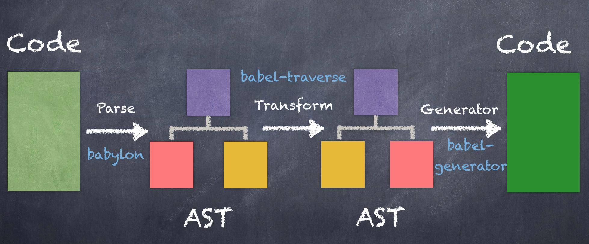

1.  babel 是什么？
    > babel 是一个 JavaScript 编译器。
2.  babel 做了什么？
    > 它的作用是把 es6+转成 es5，甚至更低的版本。以便能够运行在当前和旧版本浏览器中或者其他环境中(如 node)。不过目前 es5 规范已经足以覆盖绝大部分浏览器，所以一般转成 es5 就足够了。
3.  babel 怎么做的？

    babel 从编译到完成总共分三个阶段：解析、转换、生成。

    
      > 原谅我盗图。

      - 解析

        使用 babel（内部使用的是 babylon 类库）解析器对输入的源代码字符串进行解析并生成初始 AST(抽象语法树)。这里有在线编译 AST，有兴趣的看看 [AST 转换](https://astexplorer.net)。

      - 转换
        babel 自 6.0 起，就不再对代码进行转换，只负责解析和生成流程，代码转换过程全部交给了插件(plugin)去做。如果不配置插件，将代码解析之后会在输出同样的代码。因此需要为其添加插件。

        ```javascript

          {
            "plugins": [
              "@babel/plugin-transform-arrow-functions"
            ]
          }

        ```

        现在，我们代码中的所有箭头函数都将被转换为 ES5 兼容的函数表达式了

        ```javascript
        const fn = () => 1;

        // converted to
        var fn = function fn() {
          return 1;
        };

        ```

        代码中箭头函数已全部转换完成，但如果还有其他的 ES6+语法需要转换，那怎们得一个个添加所对应得插件，这样太麻烦了。还好`Babel`提供了一个`preset`(即一组预先设定的插件)。
        就像插件一样，你可以根据所需要的插件组合一个自己的`preset`

        ```javascript

        {
          "plugins": [
            "@babel/plugin-transform-arrow-functions"
          ],
          "presets": ["env", "stage-2"]
        }

        ```

        既然`plugins`和`presets`都可以处理代码转换功能，那它们同时存在处理顺序是怎么样的呢？
        `plugins`与`presets`同时存在的执行顺序：

        1. 先执行`plugins`的配置项，再执行`presets`的配置项。
        2. `plugins`配置项，按照声明顺序执行。
        3. `presets`配置项，按照声明逆序执行。

        所以上述代码的执行顺序为：

        1. `@babel/plugin-transform-arrow-functions`
        2. `stage-2` [什么是stage-2?](https://www.babeljs.cn/docs/presets)
        3. `env`
    
      <!-- 来聊聊`env`，`env`主要作用是通过配置得知目标执行环境特点，只做必要的转换， -->
      continue
    - 生成
    `Babel`会根据`AST`然后解析相对应的代码。
