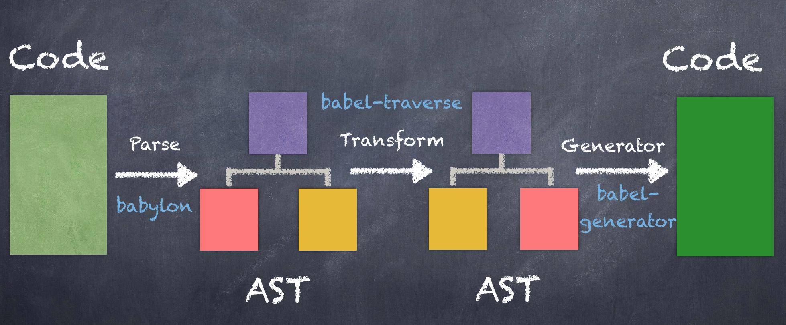

1.  babel 是什么？
    > babel 是一个 JavaScript 编译器。
2.  babel 做了什么？
    > 它的作用是把 es6+转成 es5，甚至更低的版本。以便能够运行在当前和旧版本浏览器中或者其他环境中(如 node)。不过目前 es5 规范已经足以覆盖绝大部分浏览器，所以一般转成 es5 就足够了。
3.  babel 怎么做的？

    babel 从编译到完成总共分三个阶段：解析、转换、生成。

    
      > 原谅我盗图。

      - 解析

        使用 babel（内部使用的是 babylon 类库）解析器对输入的源代码字符串进行解析并生成初始 AST(抽象语法树)。这里有在线编译 AST，有兴趣的看看 [AST 转换](https://astexplorer.net)。

      - 转换
        babel 自 6.0 起，就不再对代码进行转换，只负责解析和生成流程，代码转换过程全部交给了插件(plugin)去做。如果不配置插件，将代码解析之后会在输出同样的代码。因此需要为其添加插件。

        ```javascript

          {
            "plugins": [
              "@babel/plugin-transform-arrow-functions"
            ]
          }

        ```

        现在，我们代码中的所有箭头函数都将被转换为 ES5 兼容的函数表达式了

        ```javascript
        const fn = () => 1;

        // converted to
        var fn = function fn() {
          return 1;
        };

        ```

        代码中箭头函数已全部转换完成，但如果还有其他的 ES6+语法需要转换，那怎们得一个个添加所对应得插件，这样太麻烦了。还好`Babel`提供了一个`preset`(即一组预先设定的插件)。
        就像插件一样，你可以根据所需要的插件组合一个自己的`preset`

        ```javascript

        {
          "plugins": [
            "@babel/plugin-transform-arrow-functions"
          ],
          "presets": ["env", "stage-2"]
        }

        ```

        既然`plugins`和`presets`都可以处理代码转换功能，那它们同时存在处理顺序是怎么样的呢？
        `plugins`与`presets`同时存在的执行顺序：

        1. 先执行`plugins`的配置项，再执行`presets`的配置项。
        2. `plugins`配置项，按照声明顺序执行。
        3. `presets`配置项，按照声明逆序执行。

        所以上述代码的执行顺序为：

        1. `@babel/plugin-transform-arrow-functions`
        2. `stage-2`
        3. `env`
    
        来聊聊`env`，`env`主要作用是通过配置得知目标执行环境特点，只做必要的转换，
        例如目标执行环境支持ES2015，那么ES2015`preset`是不需要的，这样代码量就少了写，构建时间也减少些。
        
    - 生成
    `Babel`会根据`AST`然后解析相对应的代码。

其他配置工具

babel-cli
是一个能够从终端(命令行)使用的工具，安装了babel-cli之后，就可以使用命令行去处理编译了，
比如代码合并、编译等等

babel-node
它是cli的一部分，不需要单独安装。它是运行在node环境中，直接运行es2015代码，不需要额外的进行转码

babel-polyfill
`babel`默认只转换js语法，对于一些新的API是不会转换的，例如`Promise`,`Set`,`Maps`,`Symbol`等全局对象，以及一些定义在全局对象上的方法(例如Array.from、Object.assig等)。
要想在不支持这些API的环境中使用它们，这时候就需要使用到`babel-polyfill`，它有两部分组成
1. core-js： 转换一些内置类 (Promise, Symbols等等) 和静态方法 (Array.from 等)。绝大部分转换是这里做的。自动引入
2. regenerator：作为 core-js 的拾遗补漏，主要是 generator/yield 和 async/await 两组的支持。当代码中有使用 generators/async 时自动引入。

为了使用以上新API的功能，`polyfill`把所有的方法添加到内置原型链当中， 如果我们只是用了某一个新的API，却也要把其他功能的加上，这无疑是一种极大的浪费，会导致构建出来的包非常大。
另外`polyfill`会污染全局变量，给很多类的原型链都做了修改，如果我们开发的也是一个类库提供其他开发者使用，那就可太不秒了。

`babel`转义后的代码会出现大量重复的代码，会导致编译后的代码体积变大，为了解决这个问题，`babel-plugin-transform-runtime`就诞生了，它能很好的解决这个问题。它能很好的避免`babel`编译的工具函数在每个模块都从重复出现，减少代码的体积。
简单来说：
1. babel-runtime 是供编译模块复用工具函数
2. babel-polyfil是转译没有的api. 例如 Map,Promise之类的

以上是Babel 6.x。

`Babel7.x` 
正在舍弃`Stage preset`,完全取代了之前的一些预设，比如prset-es201x等。
包名称的变化：语法解析核心插件 `babylon` -> `@babel/parser`,`babel-cli` -> `@babel/cli`,`@babel/` 替换 `babel-`, `babel-preset-env` -> `@babel-preset-env`
```javascript

{
  "presets": [
  -  "env"
  +  "@babel-preet-env"
  ]
}

```
@babel/node 从 @babel/cli 中独立了，和 babel 6 不同，如果要使用 @babel/node，就必须单独安装，并添加到依赖中。
